Lab 1: Loading Data In Looker

In this lab, let's go through the data that will be analyzing when we're creating our analysis reports, looks and dashboards. So, you have a familiarity with what we're working with.

So you can find this Excel file in the GitHub repository of this course.

`https://github.com/fenago/looker-bootcamp/blob/main/ElementRentalData.xlsx`

**Note:** You can open open the file in microsoft office or view the file in below online viewer:

`https://view.officeapps.live.com/op/view.aspx?src=https%3A%2F%2Fraw.githubusercontent.com%2Ffenago%2Flooker-bootcamp%2Fmain%2FElementRentalData.xlsx&wdOrigin=BROWSELINK`

So, well, what I've done over here is I've created a sample company called Element Rental.

What they do is they simply rent out heavy equipment to companies.

OK, and they have offices all over the U.S.

So the first table simply tells us the products that are available to be rented.

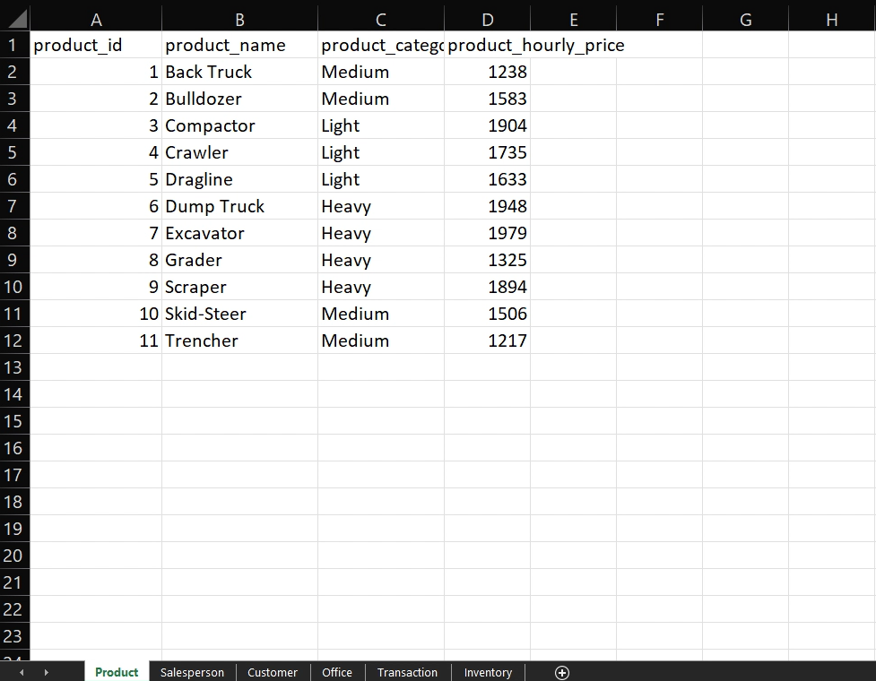

You can see here that there are 11 products at truck bulldozer, compactor crawlers, things like that,

For example, they might have like 20 bulldozers, right?

But all of them have a product idea of to any product name of bulldozer, and each product also gets a category.

There can be medium products, light products or heavy products.

And you also know what the hourly price for rent is for every product.

So, for example, if a customer wants to rent out a `compactor`, it would be `$1904` per hour.

OK, so that's a product.

We also have a table that lists all of our salespeople.

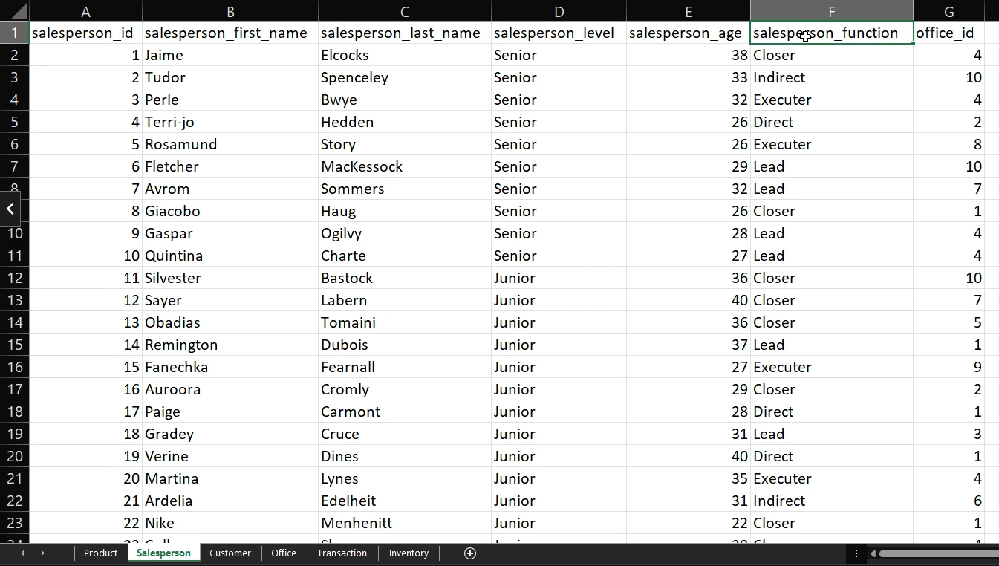

We can see we have 100 salespeople.

We have their first name, last name, what level they are.

There are about 10 seniors and the rest are juniors.

We know their age and function they they serve.

Some are direct salespeople, some are lead salespeople and so on and so forth.

And we also know the office that they belong to.

The next is our list of customers.

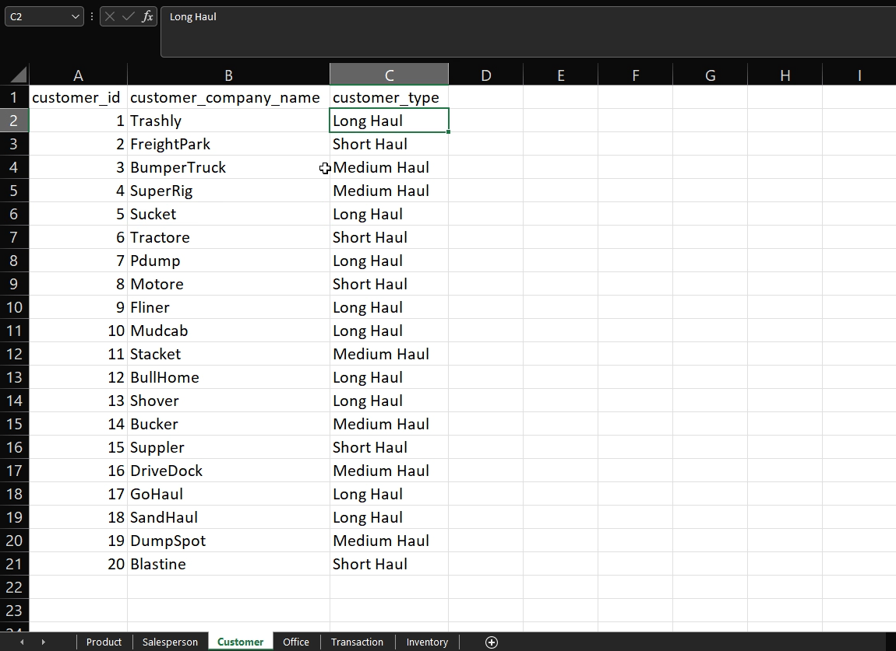

This company has 20 customers.

So we have their customer I.D., we have their customer company name.

And then you also know with a customer type is so `Trashly` is a long haul customer, whereas `BumperTruck` is a medium haul customer, for example.

OK, next, we have data about our offices, so we know for.

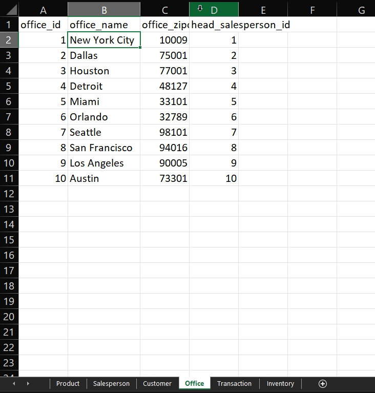

We have 10 offices. Each office has a name and zip code.

And we know who the sales person who the head salesperson id for each office.

OK, then we go to our biggest dataset, which is transaction.

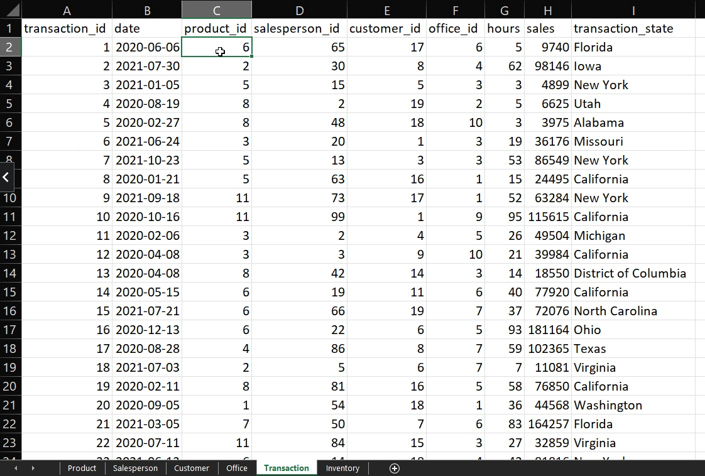

Each row here represents a transaction or basically like a buying or selling.

Over here, what we see is basically a list of transactions and for each transaction ID.

So for each transaction, we know the date it occurred, what product was sold?

Who sold it to the salesperson ID, who it was sold to the customer and what officer was sold in.

The number of hours that the product was rented out for and the total sales.

Basically, the rental happened on June 6th.
And perfect, the next thing, and the last one we have is the inventory.

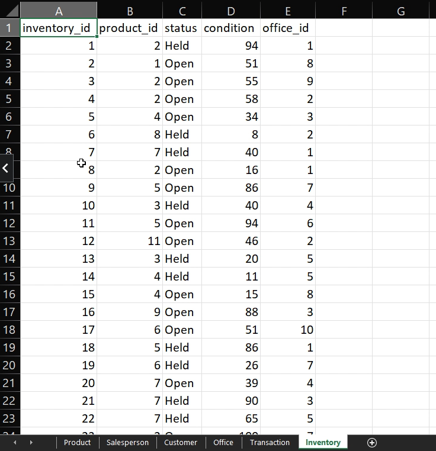

So all of our inventory and looks like we have about 200 pieces of inventory.

From one to 200, and each piece tells us what product ideas, the status of it, so if it's held by someone or if it's opened to be sold, the condition it's in, which is a number between zero to 100,

100 being high condition, zero being low condition and the office that it's currently in.

So, for example, inventory ID `1` is a bulldozer that is being held.

It's in pretty good condition.

Hell, it means it's with a customer right now, and it's part of Office `1`, which is New York City.

### Loading Data

The next thing that we need to learn how to do is to import our element rental data i-e:
Product, salesperson, customer, office, transaction and inventory to our looker instance.

So what we're going to learn is how to bring in that excel data into Looker.

This method will work both if you're using the sandbox environment or if you have your own locker instance.

Let's turn on development mode over here.

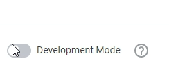

Go to develop.

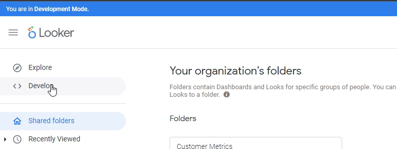

Go to if you're in your sandbox instance, then click with clubs flights, if you're not, then there should be another project that you can use instead, so just click any project that's in here.

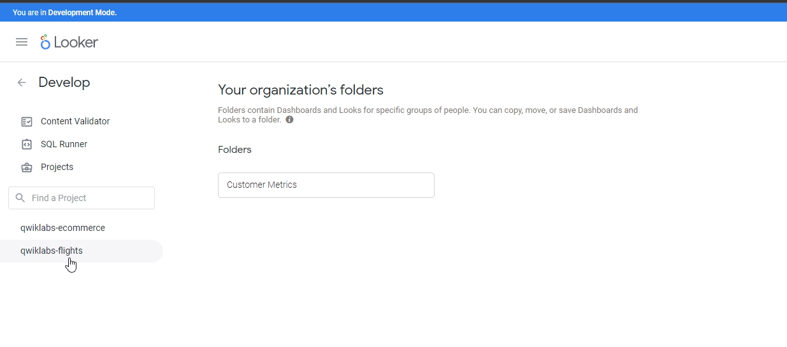

If you are using your own instance, you can select any project.

And what you're going to do is you're going to find any thought model file, OK, in your file browser here.

Now, if you're again using the sandbox instance I Google provides, then choose this one looker underscored basic site model.

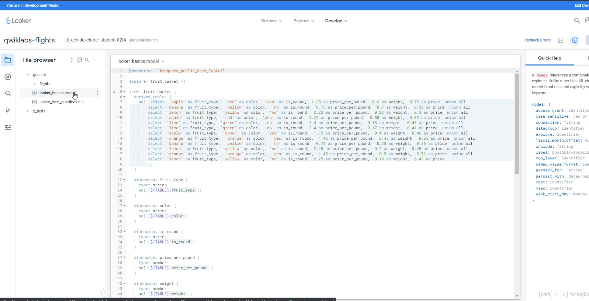

But if you're in your own instance, you can choose any .model.

And then all you're going to do, OK, is go to the very end of that file and put in some spaces.

Now, open up the element rental file:

`https://github.com/fenago/looker-bootcamp/blob/main/ElementRentalLookML.txt`

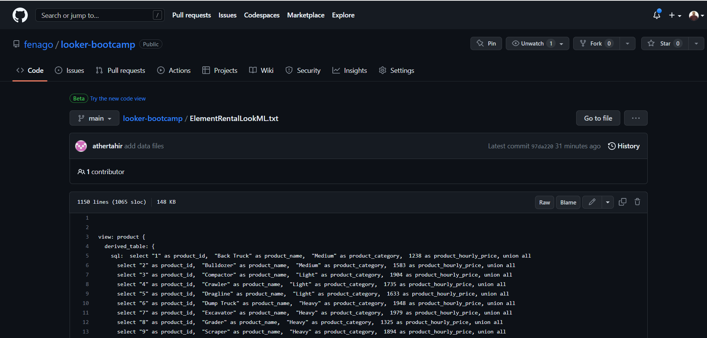

And you're going to copy and paste that into here.

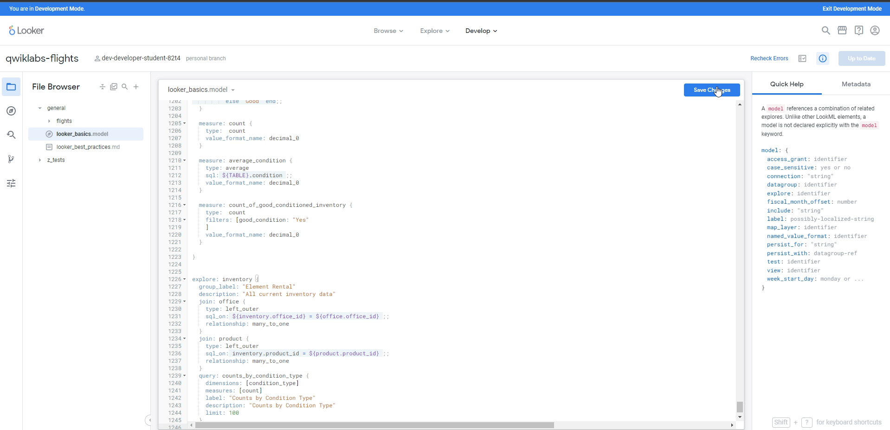

I'm going to copy it when you go back in here and you're going to paste it at the bottom of this file.

If you're using your own instance, then just do it at the bottom of that file.

So I'm going to put that in here and then click save changes.

And that's it, I'm done, what I need to do now is go back to Lookers Home page, so I just click look `Looker` on the top left.

And now if I click Explore. I should see a limited rental category.

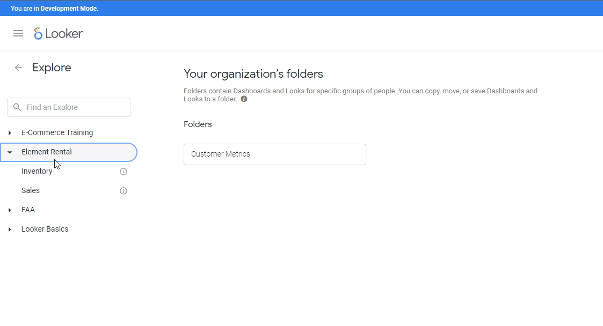

And if we click it, we should have access to both sales and inventory.

OK, so if you've reached the stage that awesome, you've set up your environment perfectly.

If you are using sandbox environment, you have to follow the same process again once your instance refreshes.

Again, you have to turn on development mode, go into develop.

Right by any point, model, file copy and paste from the text file and save changes.
