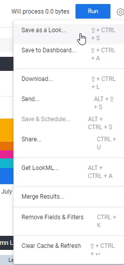

Lab 10: Creating a Look
------------------------

In this lab, we'll learn how to store or save all of the amazing analysis that we've done.

Explores or a way to explore your data, but there are temporary.
After you explore your data, after you leave it, refresh the page, move away.
It doesn't really save your results.

However, there are certain pieces of analysis that you will want to rerun on a monthly basis, weekly basis, daily basis or ad hoc.

And you don't want to go through it and actually select the fields and do the customizations every time. So, what we're going to learn today is how you save all the analysis you do with explorers using something called **looks**.

The looks are basically reports that you can save reports or simply just pieces of analysis that can be rerun at any point in time.

What we're going to do over here is we're going to look at the trend of sales by month.

Let's select `Total Sales` and `Month`.
If this is a sales report, so we also want to see who's actually making these sales. Let's do `salesperson function` as a pivot.

Let's click `Run`.

Let's go to visualization and select `column` chart instead, and also make it a `stacked` column chart.

The total bar tells us how much sales there were that month, and each portion
here tells us if it was from a direct sales person, it was from a closer, from an indirect, from a let's see from a lead or an executor.

For example, September looks like most of the sales were from lead sales people.
Whereas in March looks like a lot of it was from indirect sale.
That's pretty important.
And this is a piece of analysis that I probably want to do every month.
So let me save it.

What we're going to do now is click the gear icon and select `Save as a Look`.

We're going to call or look or report again, they're interchangeable monthly sales reports.

**Title**: `Monthly Sales Report`

**Description**: `This report shows us the distribution of monthly sales by salesperson function - this report shows all months.`

Places, we can share it and we can share it in our shared folders.
Right now, we only have one.

We can share it in your own folder, your own personal folder. Or you can share it in someone else's folder as well if you have access.

We're simply going to share it within our own folder, which is what I suggest you do as well if you're in a developer instance account.

OK, we then going to click `Save & View Look`.

This is our report. A few things here that we will go through for the actual layout. The top is our actual.

Is the actual title of a report, we can see your pane over here that shows the details, but this tells us the description.

We also see three things over here that are fairly important.

We see the amount of rows that were output.
We can see if it was from cache or from table and with the most important
thing that it tells us over here is how many minutes ago was this report generated.

This is pretty important because if you have transactional data, for example, that might update every
10 minutes, you might want to know if this report you're looking at is from one hour ago.
Or if it's from the last minute, because then that might change your interpretation of the data.

Not only do you have the visualization here, but you also have the underlying data, so you can always
click data, for example, look at it most times, though the visualization is enough because again,
if you want an actual number, you can simply just highlight over it and get that number.

So, this is your look and it's also called a report.
