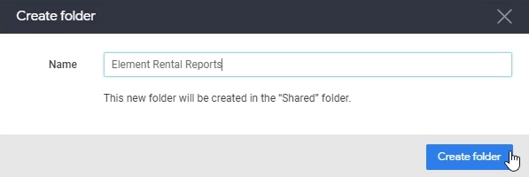

Lab 11: Organize and Edit Look
------------------------------

Let's create a another look and then talk about where you can actually find these looks and what they look like.

We're going to go back to `Explore`, select `Sales` again and we're going to create a different look this.

We're going to create a performance report, so we're going to look at the average sales for each sales person.
And we'll look at for that salesperson, we'll look at their average sales and their total sales.

`Average Sales`, `Total Sales`, `Salesperson First Name`, `Salesperson Function`, `Salesperson Last Name`, `Salesperson Level` and `Salesperson Office Name`.

Let's click `Run`.

And we just want to make this a simple table over here.

Let edit this table a little bit.
Go to `Series` and select `Average Sales` and we're going to turn off `cell visualization`.

What we want is some conditional formatting that tells if someone's really lowering the bar here. Let's see if the average sales is lower than `70000`. And these people should be flagged.

We're going to do is add a rule like:

**Apply to**: `Select Fields` > `Sales Average Sales`

**Format**: `If value is less than`

**Value**: 70000

**Background color:** `Red`

We're now going to `Save as a Look` again.

We're going to click Save as they look and we're going to call this sales person report.

**Title**: `Salesperson Report`

**Description**:  `This report shows the performance of salespeople - underperforming sales people are shown in red.`

Click `Save`.

Let's go to folders and let's go over here to my folder.
And this is where, again, we've saved our looks.
So if you do that, you can see all of your looks over here.

Again, we have to, but these sales report and salesperson were.
So that's how you can find your looks.
They're basically shared or stored in this folder.
Now we can also, for example, move this look if we want to a shared folder which is accessible by multiple people.

### Organize Look

In this section, we will look into moving and copying looks.
Currently, we have two looks in the folder.
Now you can have shared folders over here, which we have already created one or it's already created for us, really called customer metrics.
And each person has their own personal folder as well that you can look into if you have access.

Let's say if we want to create first a new shared folder, let's go over to shared folders and click new and we'll click Folder.

And in this folder, we want to store all of our elements rental reports, reason why you were put looks or in a folder is if you want other people
to have access to it.

Let's go back to my folder, which has those two looks. And we're going to simply move this to `Element Rental Reports`.

Let's move other report as well:

We also copy it if you want to keep a local copy, but we just want to move it.
If you go to our shared folders `element rental reports`, we can see these two looks.

Let's see if we want to look at the `monthly sales report`.
We just click it and it's there.

What's nice about putting all your reports into one shared folder as well is it's easier to switch between different reports. So we can click below icon:

Switch between our monthly sales report to the salesperson report if we need to.
That's how you move looks between one folder to another.
And that's how you quickly change between looks that you see as well.

### Edit Look

Let's start working on editing looks, editing looks is actually fairly easy.
There's a `Edit` button that allows you to edit any look that you've created.

If you click `Edit`, let's say if we want to also add in their age, well, once we click, it shows us a very similar thing to what we see when we explore.

Now, go to Salesperson and click `Salesperson Age`.

And we can just click `Run`.
We've now added in the age, you can also edit the title of the report and save it as a different look if you want as well.
That's how you edit those things about reports.

Let's click `Save` to save your changes.

