Lab 12: Filters in Looker
--------------------------

In this lab, we'll look into filters.
Filters are basically a way to limit the data you use for your analysis.
For example, you might want to filter the data to a certain customer to a certain time period, or
you want to maybe limit the amount of rows that are displayed in your output.

Let's do a quick exercise of how you add a filter. We will create a very simple analysis.

We are going to look at the distribution of `Total Sales` by `Office Name`.
Now this gives us basically all time period data.

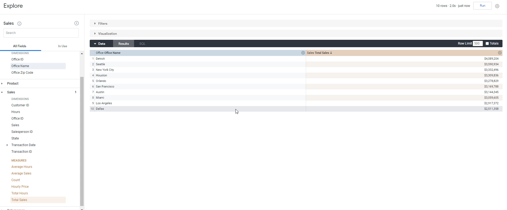

Well, let's say if you only want to look at, you know, the last month, for example.

Well, what we can do over here is, well, really there's two ways to do it right.

If you don't use filters, the way you'd have to do it is you'd have to go to a `Transaction date` and go to transaction `Month`.
You would have to add this as a Dimension.

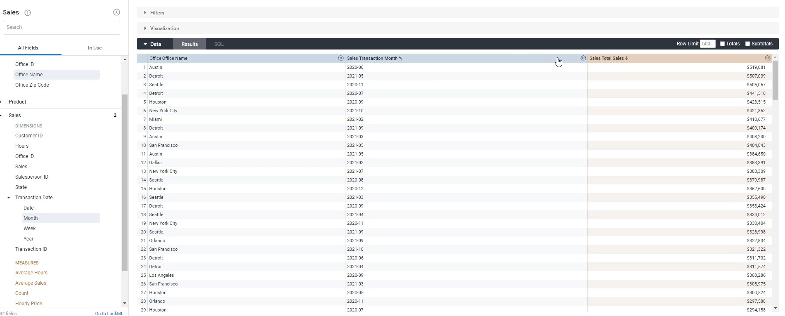

And then what you would need to do is basically sort it and just look at `2021-10` and just look at this data over here. These are the values that we want, but that's complicated.

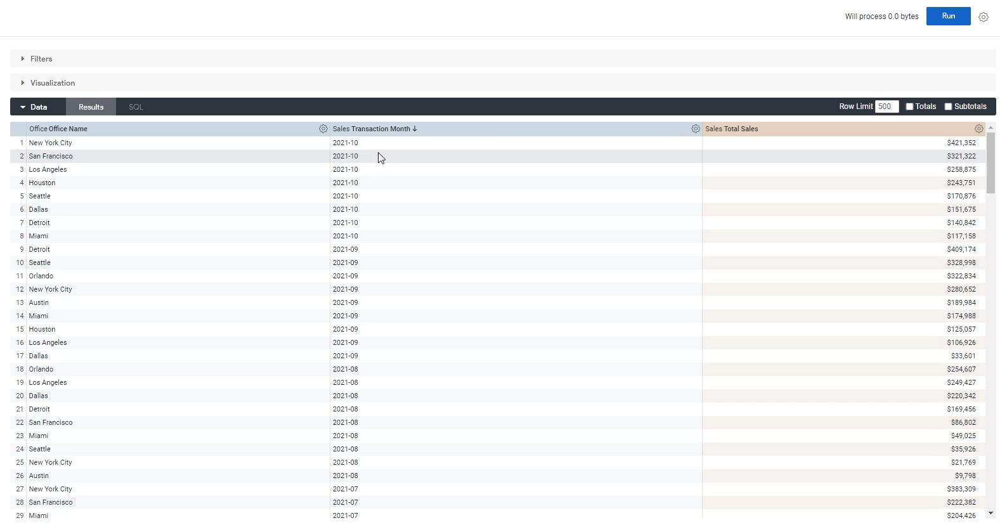

It gives us these values which we don't really need and so on and so forth.
So, here's how you add a filter.

First way you can do it is when you hover over the actual dimension, if you click below icon, this adds a filter:

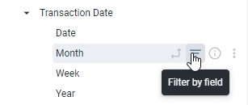

Filters change on what you can do based on what the filter type is.
So, since this is a date, it gives us the option of in the past three months or before X number of days and so on and so forth.
So we want to do let's do in the past three months.

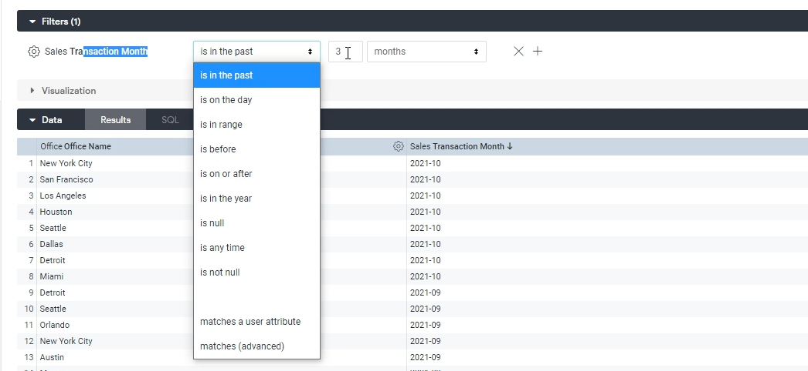

And perfect, now we've limited our date out to October at September, early, it's November of 2021.

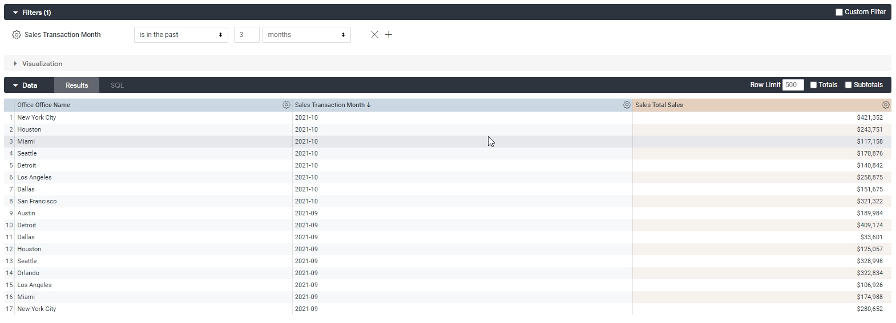

You can also change this if you want to.
For example, you can pick a certain date range is often used as well, so you can select a time range, but we want to select, for example.

August 1st - August 31st.

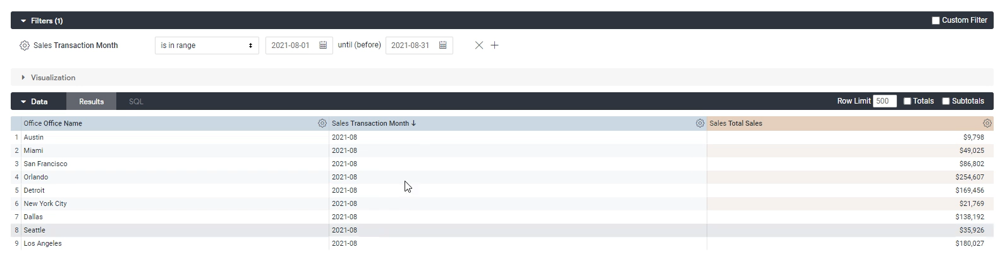

Now, you should only show us `2021-08`.

That's the first way to add a filter. Let's take out the filter:

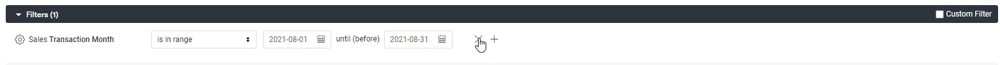

The other way out of Filter is directly. 

So, we want to filter out on this, so we click filter, it pops this up.

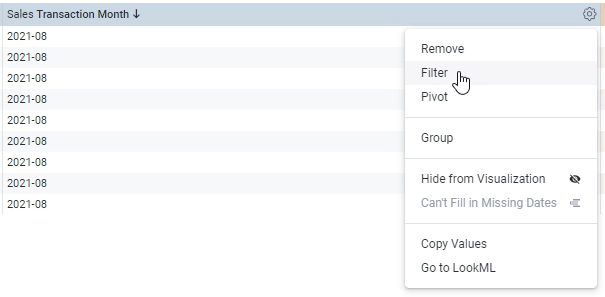

We can also actually click the value of a dimension and filter this way, too. Nice thing about clicking on a value is that it already sets the filter for you. Let's see if we only want to look at `2021-08`:

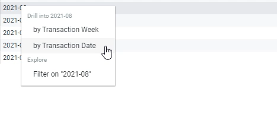

Let's see if we only want to look at `2021-09`, we can just click `Filter on 2021-09`.

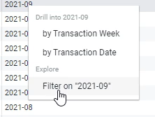

Let's click `Run`.

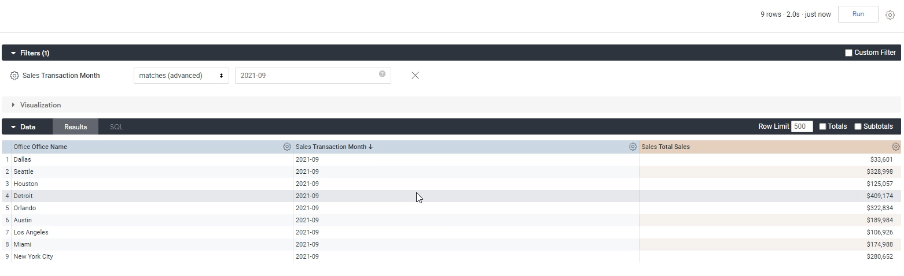

That's a all on filtering within Looker.