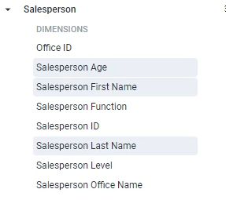
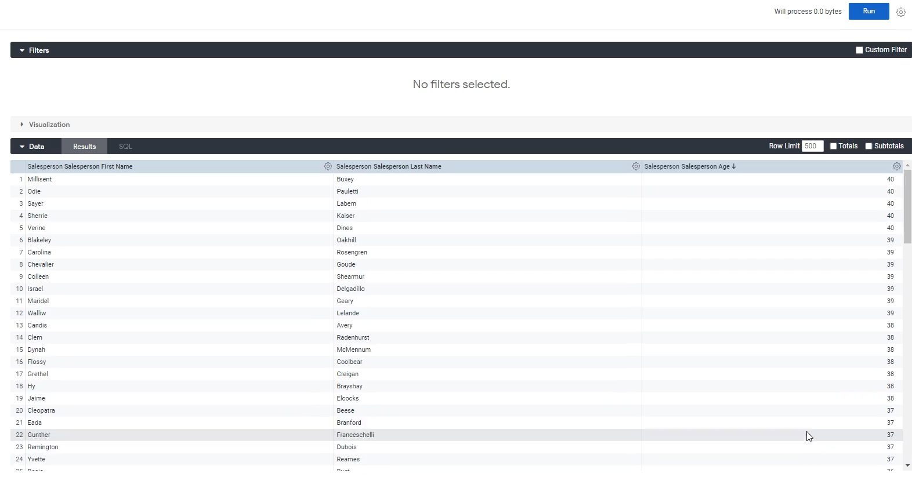
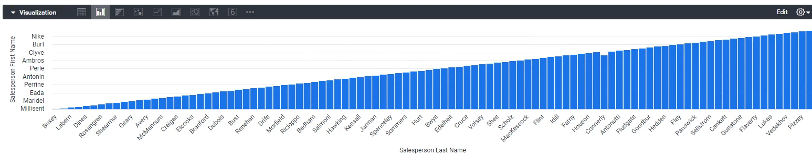
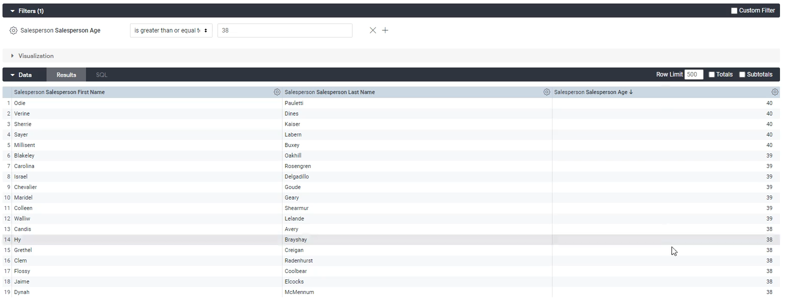
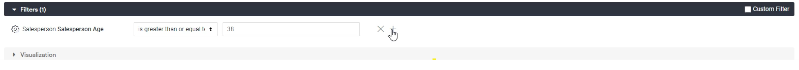
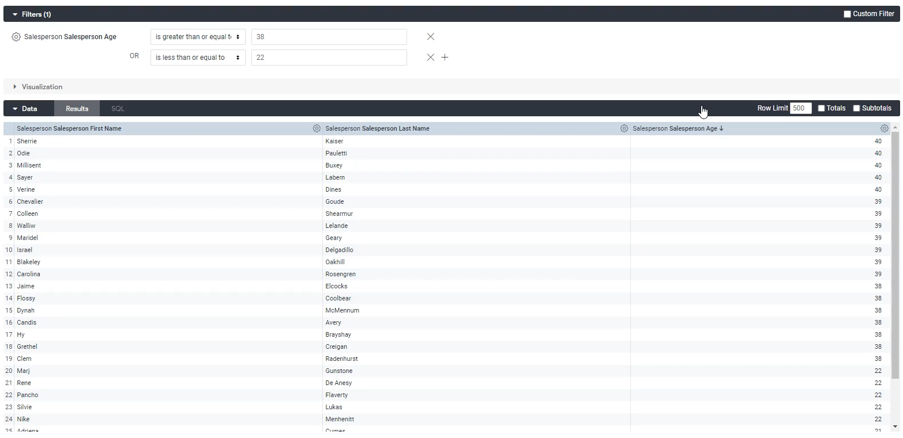
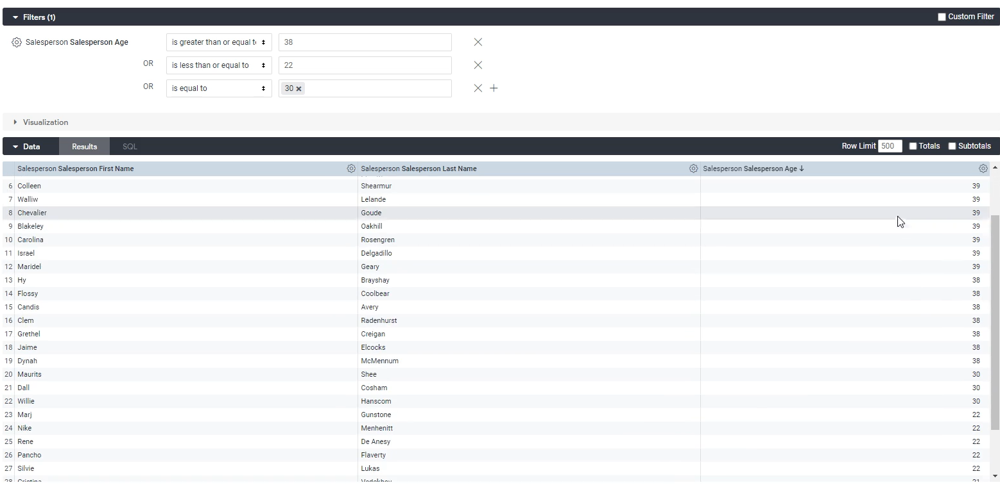
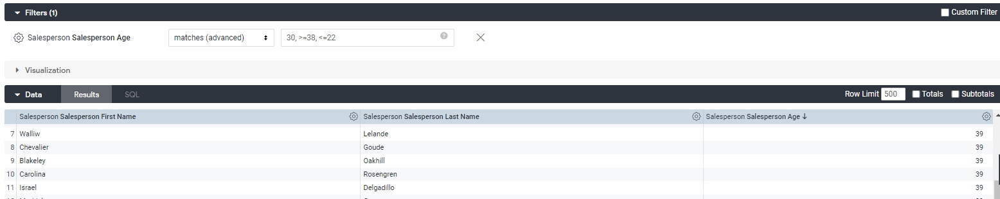

Lab 13: Using Operators in Looker Filters 
-----------------------------------------

In this lab, we will look at some advanced filters.
Advanced filters basically just adds the complexity of and and or statements to your analysis.

What we're going to do over here is we're going to add in a filter. Let's look at our data first.

Let's look at `salesperson first name`, `salesperson last name` and `salesperson age`. Let's click Run on that.

This will give us basically a report of all the salespeople that we have and their age, and if we sort by `age` column, we'll see that the oldest person is 40 years old and the youngest person is 20 years old.

We can even add a visualization to visualize this if we want, but we don't really need to.

We have 100 rows. Now, let's say, if we want to add a filter and let's say if we only want a filter to our oldest people, so we're going to add a filter over here on salesperson age where salesperson age `is greater than or equal to` 38.

OK, now let's say, in addition to that, we also want to filter to where salesperson age is less than or equal to `22`.
But we want the oldest of the old and we want the youngest of the young.

Well, how do we do that using complex filtering, how to do that is basically you with a plus sign:

So you want the filters to be true, you want salesperson to be `is greater than or equal to` 38 OR `is less than or equal to` 22.

This will show us our oldest and our youngest.

Now you can also add more things over here, too.
You can also do something like: `is equal to` 30.

It's working exactly like we want to work. That's how you add more complexity to your filters.

**Matches Advanced**

What we're going to do over here is show how to use a function in looker called matches advanced.

Let's try to reiterate the same thing we did before. Less than or equal to `22` OR greater than or equal to `38` OR equal to 30.

We can will get same results by running following filter:

