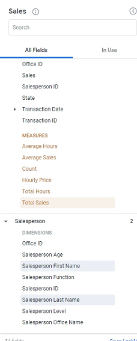
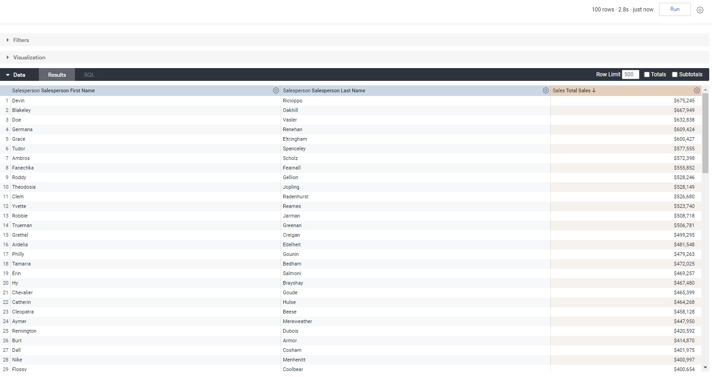
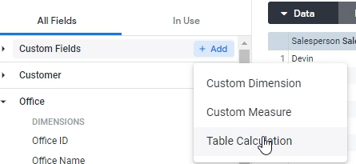
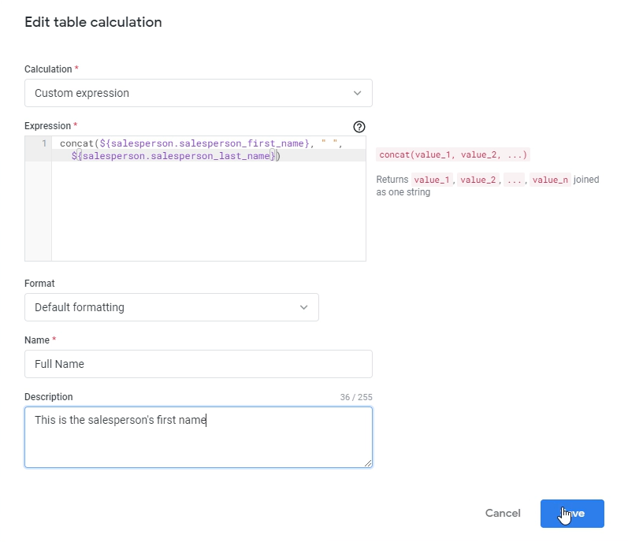
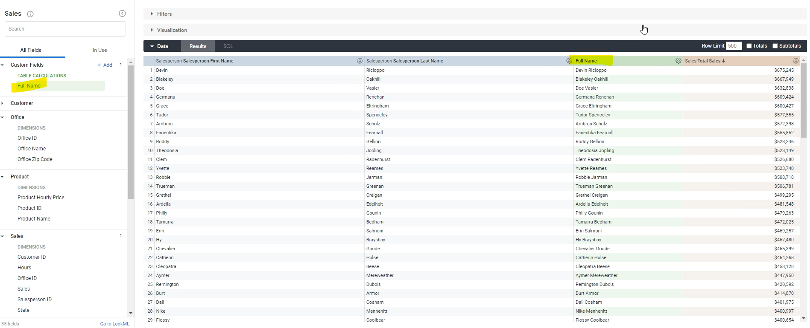
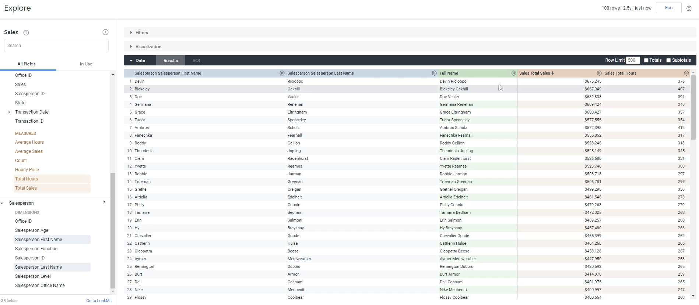
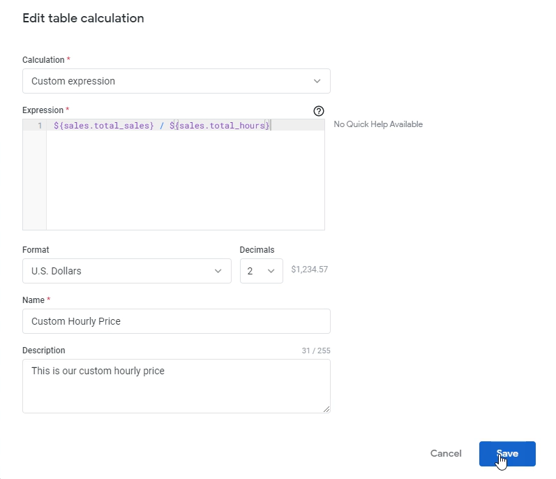
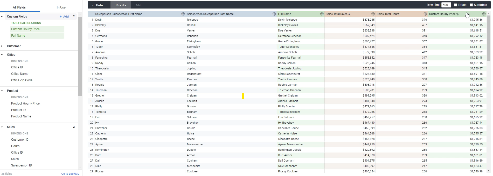

Lab 14: Table Calculations
--------------------------

In this lab, we will look into Table Calculations. Let's go ahead and get started with table calculations.

Let's do this, what we're going to do is look at salespeople and make a report for them.

We'll do `salesperson first name`, `salesperson last name` and we'll select `total sales` that they've made.

Let's click **Run** on that.

Now, the first thing to know about table calculations is that they appear after you've run your query, so table calculations or calculations that are done after your query has been run.
So this is post aggregation, that's another word for it.

And in order to actually create a table calculation, there are well, generally two ways the first way to do it is to go over custom fields like section and then click table calculation:

Once you're over here, it basically asks you a few things. First of all, what do you want the calculation to be called.

**Calculation**: `Custom expression`

**Name**: `Full Name`

**Description**: `This is the sales person's first name.`

`concat()` takes value one and value two, and it can customize it, concatenate them together so let's do that.

We're going to go over here and we're going to cut to values. The first value will be the salesperson first name.
And then we probably need a space in between.
So we are going to put the second argument as just a blank space.
And then finally, the last name.

Let's click `Save` and there we go.

All we've done is we've created a new table calculation field that can concat two dimensions together. The columns in green are always the ones that are going to be custom columns.

Let's also do a table calculation on a measure. We're going to first add in `total hours`. Let's click Run on this.

What we want over here is for each salesperson, we want the average hourly price that they're charging. That's `total sales` divided by `total hours`. Let's add a simple table calculation for that.

So again, it's going to be a custom expression, and it's simply going to be Total sales divided by the total hours.

**Calculation**: `Custom expression`

**Name**: `Custom Hourly Price`

**Description**: `This is our custom hourly price`.

**Format**: `U.S. Dollars`

**Decimals**: `2`

Let's click `Save`.

Now, we've added another table calculation that simply the sales amount divided by the hours amount, which is the estimate hourly price.
So, you can use these things to create as many table calculations as you want.

Again, the key difference being here is a table calculations or calculations that happen after you get these results.
So, these formulas don't happen until after the results are made.
They don't happen on the base data and happen on the output data.

So that's the that's a very easy way to add custom expressions as table calculations.