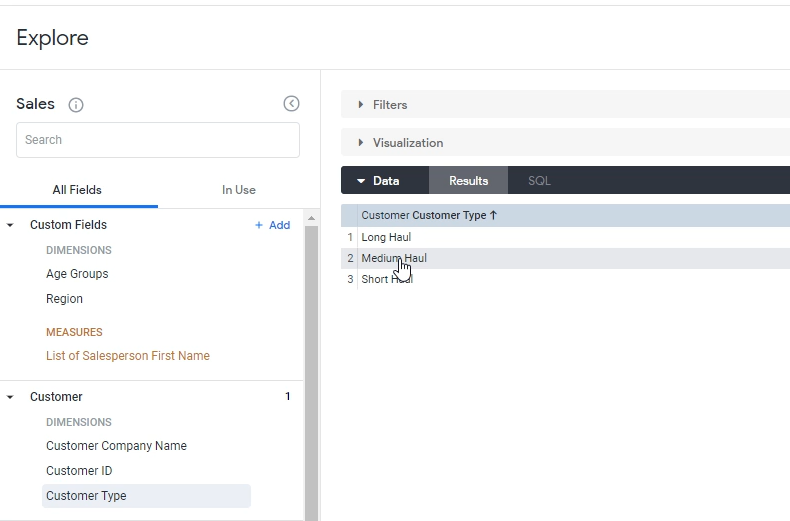
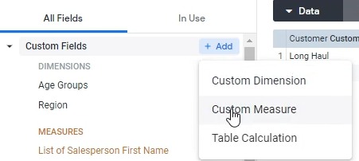
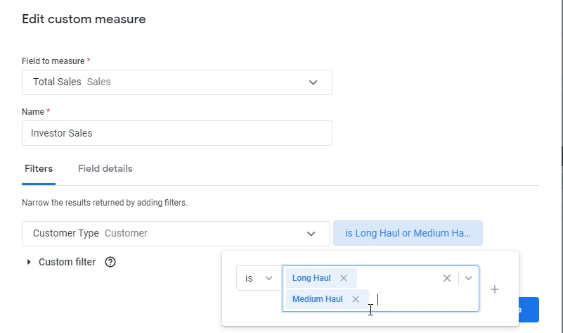
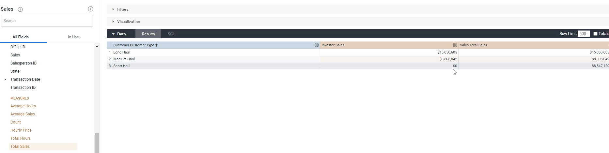

Lab 15: Custom Measure
----------------------

In this lab, we will look into how to create a custom measure.

Custom measures are basically just measures that you filter for first before any aggregations happen.

Let's say if you don't want total sales, you want only sales from `California` Or something even different like sales from the a particular customer.

If we look at customer type, see what we have in customer.
We have `long haul`, `medium haul` and `short haul`.

Let's say if we really care about `long haul` and `medium haul` sales, those are the sales that are investors really care about.
OK, we're going to add a new custom measure.

Go to Custom Fields section and click `Custom Measure`:

**Field to measure**: `Total Sales`.

**Name**: `Investor Sales`

And we're just going to say that this is only sales or only total sales, right where the **customer type** is `Long haul` and `Medium haul` only.

We're going to click `Save`.

And let's also do `total sales` as well as just obviously the difference.

So what we should see here is that the investor sales and total sales are the same for long haul and medium haul, but for short haul, there's zero perfect.

OK, that's exactly what we want.

And again, why you would do this is if you want to create a measure that restricts a current measure based on a filter.
