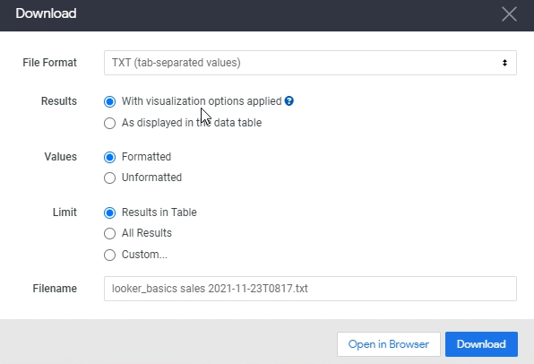

Lab 16: Download and Organize Data
----------------------------------

In this lab, we'll learn how to download the analysis that we've created.
The first thing we need to do before we start is to create an analysis.

Let's open explorer and show the `total sales` by `office name` over here.

Let's also add a quick  bar chart visualization as well

And also add in a pivot that will tell  if the sales come from junior salespeople or senior salespeople.

Let pivot the `salesperson level`, and let's click Run again. Let's make this a **stacked** bar chart, and there we go.

Now, in order to download data and any of the analysis that we've done, if you're in looks or you've been in dashboards, you can simply go to the gear icon and click download and you have a
bunch of different options over here that you can choose from.

The first option is the Results. Do you want visualization options applied or not?

Basically, it says a looker applies from the visualization settings to you to for you to download. So,if you want to show row numbers totals, row totals, things like that.

If we do add in things like `totals`, `row total`, we
can add in here if we want to, let's click **Run** on that.

Let's click Gear icon again and select **Download**.

You also have **Limit** option, what we see over here is only 500 rows.
If you click this, it'll only show you the number of results that you see over here in this table.

But what you might want is you might only want to preview the first five rows, but download everything. In that case, you would select `All Results`.

And then you have the file name.
Over here, the file format, you have a bunch of different options text edit, you can select an Excel, spreadsheet, CSV, JSON HTML or markdown.

Let's see what they all look like.

`TXT` and `CSV` are very similar. The difference here is that csv or comma separated and txt are tab separated.

So let's look at TXT and click download. And let's open up this text file then after it's done.

As you can see, it's just tab separated values.

Now if I do the same thing for CSV, it'll look exactly the same.
The only difference is that it'll be comma separated instead.
And let's open this up in any text editor.

And you'll see this, it's exactly the same issues commerce operated instead of top separated.

OK, let's keep going through the different options.

Let's look at `HTML`. HTML gives you like HTML code that you can send to anyone and they can just open it up in any browser.

If we download HTML. It gives us HTML file that we can just email or send anyone. They don't even need access to look or anything like that because that's just simply an HTML page.

And then the final one is `markdown`, so let's see what that looks like.

It's very similar to what we've seen before, but it just makes it a little bit easier to look at rather
than if you're doing CSV or if you're doing top submitted values because there is a little separation
you see between the headers and the actual values here.

And that's how you download the data from Looker.