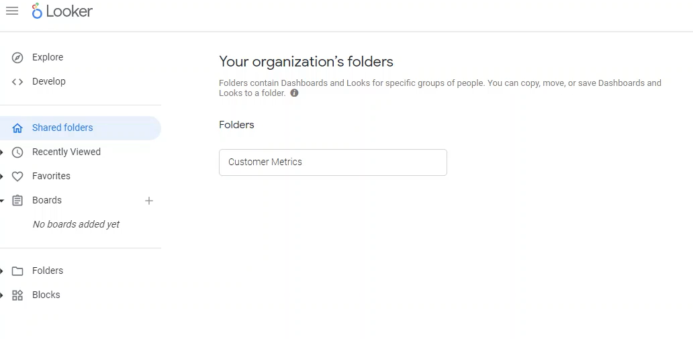
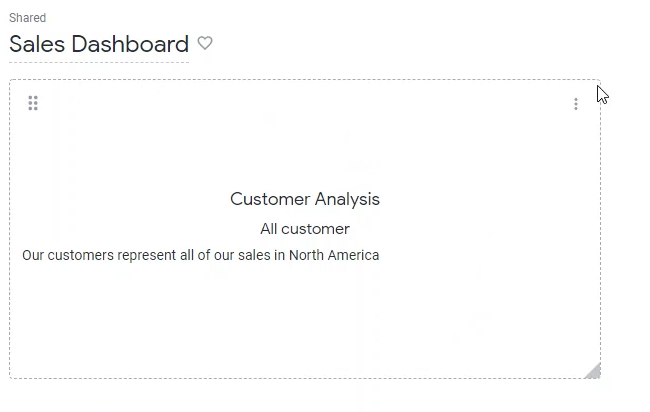

Lab 17: Looker Dashboards
-------------------------

In this lab, we'll learn how to create dashboards in Looker. Dashboards and look are fairly easy to understand. You simply just sets of tiles that can either reference a look, a query or a piece of text.

In order to start, what we're going to do is we're going to go over here and shared folders.

We're going to click the New button and then select `Dashboard`.

OK, let's name our dashboard: `Sales Dashboard` and click **Create**.

And there we go, we are now in our sales dashboard and perfect.

What we're going to do now is we're going to click `Edit Dashboard` because we want to create stuff in it.
And there we go in the edit mode is where we spend most of our time because that's where we can actually
make changes to the dashboard.

If you ever want to leave this edit mode, you can either click, cancel or save and then go back tothe other page where you can see all of your left hand side navigation.

Dashboards are made of tiles. So what we're going to do over here, for example, if you click Tile, you can add a `visualization` or a `Text` tile.

There are three different types of types of tiles. There is a textile, which is very simple.
This is basically just if you want to add text anywhere in your dashboard.

Let's add a new **Text** tile:

**Title**: `Customer Analysis`

**Subtitle**: `All Customers`

**Body**: `Our customers represent all of our sales in North America`

Now, this is a tile and it's comprised of text.

The second type of tile is called a `query visualization`.
What that means is click `Add Tile` option, select Visualization and basically come up with an explorer for us to go through.

Let's select `Sales`. And let's choose something very simple, like `office name` and `total sales`. And we're going to make a `column chart` for this.

Let's click `Run`. And there we go and we'll click `Save`.

And now we'll see that's another chart that we've created.
That's a visualization tile, but it's from a query that we had created ourselves over here.

Last tile is also a visualization tile, but instead of it being a query that you make ad-hoc, instead, it's actually linked to a **Look**.

Let's click `Save` for now.

Go to shared folder to see the `Dashboard`:

Now, go to `explore`, go to `Sales`.
And this one we are going to do by customer so `customer company name` and `total sales` and click **Run**.
For visualization, let's make this a **Bar Chart** instead.

And let's click `Save as a Look`.

Set Title `Customer Sales`, save it in `Developer Student` by selecting **Save & View Look**.

Now, let's click gear icon and click `Save to Dashboard` option.

And we are going to save it to `Sales Dashboard`.

OK, so let's go back to that dashboard. We can see you over here now, we have a another visualization tile over here.

**Note** that that Look linked tile must be in the same folder as the dashboard for it to work properly.

Let's go into `Edit` mode.

Even though these two tiles look similar, they're actually different because first one is based on an ad hoc query we made. Whereas other one is linked to a look.
What that basically means is if you make changes to the underlying look, it will automatically update this and the dashboard.
And that's a key difference over here.
First one is not linked to anything, this is its own query that runs in this dashboard. Second one is linked to the **Look** that we had created.

The nice thing about creating dashboards from look based visualizations is because, say, if you have customer sales and many different dashboards, let's see if you have it in 50 dashboards, right?

Well, they're all pointing to the same look, and let's say if you want to change the look and instead of having blue bars, you want purple bars instead.

Well, you only need to change the look, and I'll propagate through all the dashboards.

