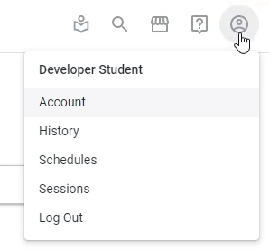
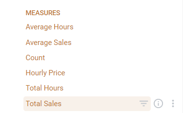

Lab 2: Menu Navigation and Creating Explores

In this lab, we will be going through the left hand side navigation menu.
If you are using a looker instance that's in your company already or you already have a personal looker,
for instance, then this part might look a bit different based on how your administrator has set it up.

However, the left hand side menu should still be there.

If you are using older versions of looker, you'll see these menus on the very top instead.

Over here, let's go to the left hand side.

The first two options over here are basically what navigates you to different menus within Looker.

`Explore` is data that can be pivoted that your administrator or that a developer has set up for you.

If you click Explore, you'll see all the different groups of data that you can explore, right?

So, for example, sales is an explorer, inventory is an explorer and so on and so forth.

We also see `Develop` as well, let's click develop, this is where we can actually create the explorers that we saw you over here and develop.

You can basically create the explorers that we've talked about.

You can also do a lot of other things like adding fields, making more aggregations, joining two tables together and so on and so forth.

Going down the list here is where we see our navigations now, shared folders is something you see by default on the home page of looker.

These are basically used to categorize and organize looks and dashboards.

So once you've created a look or once you've created a dashboard, you can, for example, put it in the customer metrics folder and you can add several folders as well.

It was also recently viewed, so if you have recently viewed a look or a dashboard, you'll see it here.

There are your favorites and there was also boards as well, which is very similar to folders, but this is another way to organize looks and dashboards.

So again, this is just folders that have been shared with you.

If you have your own folder, for example, like my folder, you can see all of your looks, reports, dashboards in there.

And there's also something called blocks, which is very particular that will go through a lot. It's another way to categorize looks and dashboards, though really for our purposes.

In summary, Explorer is a way to look at the data. All of these other things over here is a way to categorize the looks, dashboards and reports that you've created.

If you need to make any changes to your account or log out or anything like that that can be find found story on the top right over here should be able to see, for example, your history of queries, your account details, schedules, things like that.

Creating a Explore
------------------

In this section, we will be going through `explore` in detail.

What we have to do is click, Explore and these are over here.What we see is the groupings of different explorers that we have access to.

`Element Rental` is the one that we've added in previous lab.

Some explorers have descriptions that you can access by clicking or hovering over the eye button over here.

This is something that's edited and determined by the developer or the administrator.

We are now going to open up the sales explorer and see everything.

An explorer is a way to navigate and pivot data. So what the administrator has done for us is given access to the sales data of element rental.

On the left hand side, we see a field menu.

These are all the different fields that we can add in to our pivot or to our explored to do some sort of analysis on it.

We'll go through things like custom fields and use later, but just know that these are all the different fields that we can add in.

In the middle of the section over here, we see three dropdowns, sea filters, visualizations and data. And you can toggle them on or off by clicking.

Whenever you run any sort of analysis, data is what you see first. This is simply the tabular data that you've asked for from your explore.

You can then also optionally choose to see a visualization that visualizes the table below.

Finally, filters are something optional you can add in if you want to filter your analysis or data.

For example, a certain time period, a certain product, a certain office, things like that.

After you select fields, every time you select new ones, where you'll have to do is you have to click the run button over here, which actually runs the analysis.

Nothing actually gets run until you click the run button. What show is over here is just a schema of what could show.

Let's create our first explorer and see what it looks like.
Let just collapse all of these is we're simply going to look at distribution of total sales by the actual office.

So we know that there is an office over here and under office we're going to select office name.

And in sales, we're going to select `Total Sales`.

We'll go through again the differences between dimensions and measures later about what I'm going to do now is click run. And this shouldn't take too long.

From the office table, we got office name and we got total sales from the sales table. And this simply just shows us the total sales by office.

We've created our first explorer.

Now, before we go through the filters and visualizations, for example, there's also a SQL tab that we want to go through to get the full encompassing of what an explorer is.

In the next lab, we'll will go through what a dimension and what a measure is.