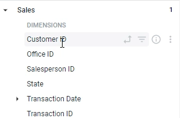
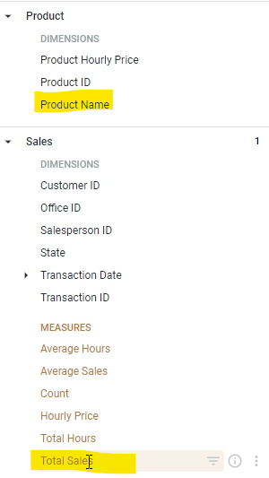

In this lab, we'll be going through in detail what a dimension is and what a measure it.

Now, a dimension can be thought of a bucket or grouping of data.

For example, if we go to a `sales` table over here, we see a customer as a dimension, which means that the sales data can be grouped by customer.

In the **product** table, we see `Product Name`. Which means that the data can also be grouped by product name as well.

Measures, on the other hand, is information about that grouping.

So, for example, whereas `Product Name` tells you that the data can be grouped by product name.

`Total Sales` which is a measure, will tell you that you can get total sales by product name, you can get that information either dimension.

And most times measures are quantitative values because they need to be information that you get about a group of data.

And if you look at a group of data can combine numbers, you can add them together, you can average numbers, you can median numbers.

You can't really say some words or.

Categories.

Right?

So the way I like to think about it is that your dimensions are usually not always your string data

like name, category date, things like that and your measures or your quantitative data sales cost

hours, minutes and things like that.

That's one way to think about it again, the other way is dimensions are a way to group your data,

whereas measures are information about that.

In order to finish this module, what we're going to do over here is we're going to add in two dimensions and two measures.

So given that we still have this over here, we're going to also add in product name as well.

And we're going to add in over here the count.

Let's click run, and then we'll interpret those results as well.

But with this analysis gives us over here is we can now see that, for example, there are six sales

or six transactions where the office was Houston and the product name was excavator.

So there are six sales that we made in this time period from the Houston office.

That was like that rented out and an excavator.

So excavator and those six transactions gave us seven hundred and seventy seven thousand in revenue.

You look at row two.

We can see the same thing over here, seven transactions from the San Francisco office.

I rented out a scraper and they gave us seven hundred thirty two thousand of revenue.

Just like that, we created a very simple report using the Explore that we had, this explore consists

of two dimensions and two measures, and the other cool thing about year two to differentiate between

the two is dimensions are in blue and measures are in orange.