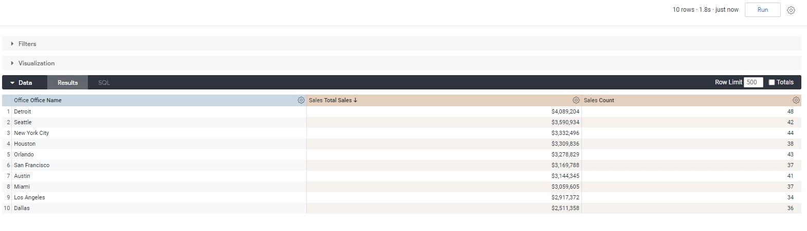

Lab 3: Dimensions and Fields 

In this lab, we'll be exploring dimensions and measures. Now, a dimension can be thought of a bucket or grouping of data.

For example, if we go to a `sales` table over here, we see a customer as a dimension, which means that the sales data can be grouped by customer.

In the **product** table, we see `Product Name`. Which means that the data can also be grouped by product name as well.

Measures, on the other hand, is information about that grouping.

So, for example, whereas `Product Name` tells you that the data can be grouped by product name.

`Total Sales` which is a measure, will tell you that you can get total sales by product name, you can get that information either dimension.

And most times measures are quantitative values because they need to be information that you get about a group of data.

### Task: Dimensions && Measures 

In this section, we're are going to add in two dimensions and two measures.

**Dimensions**

**Measures**

**Note:** Make sure that only above dimensions and two measures are selected before clicking `run` buttton.

Let's click run, and then we'll interpret those results as well.

But with this analysis gives us over here is we can now see that, for example, there are six sales or six transactions where the office was `Houston` and the product name was `Excavator`.

So there are six sales that we made in this time period from the Houston office. That was like that rented out and an excavator.

So excavator and those six transactions gave us seven hundred and seventy seven thousand in revenue.

You look at row two. We can see the same thing over here, seven transactions from the San Francisco office.

Just like that, we created a very simple report using the Explore that we had, this explore consists of two dimensions and two measures, and the other cool thing about year two to differentiate between the two is dimensions are in blue and measures are in orange.

Removing fields
---------------

In this module, we'll talk about dimension and measure manipulation.

The first thing that we can do over here is we can remove certain things.
So let's say if we don't want to look at product name anymore, we want to look at office, same only.

Well, what we can do is remove product name in two ways.

The first way to do it is to go over here. Click this gear icon and click `Remove`:

That simply removes this column from the actual data that we have now.
Again, whenever we do this, what we always seem to do is click run.
Otherwise, these results don't make sense.

We know the schema of the data will look like office name or wholesale sales count. But this is not correct data:

We have to actually click **Run** or it to now update.

We had 48 transactions in Detroit, 42 in Seattle, 44 in New York City, and so on and so forth.

Over here on the left hand side, we have office name and we have total sales and count.

It's a bit difficult to see, but the dimensions and measures that are used in our explorer are actually highlighted.

You can see that as highlighted blue, this is highlighted orange and orange.

If that was the case as well, you can see this number over here that tells you're using 
one dimension or measure from `office` and you're using two dimensions or measures from `sales`.

The second way to take out a field is by going to that field and simply clicking it. So `Total Sales` has been selected, but if you click it again. It removes it.

So let's click run, and now this will just show us the office and the count of sales.

The second way again, going to this on the left hand side is you can also click the **In Use** tab, and this very quickly shows you what's being used and what's not being used.

You can also do a `Clear all`, for example, if you want to start over and start fresh, which will be doing a lot actually when we're creating our explorers.

So those are the key ways you can remove dimensions and measures or fields as they're called from your current explorer.

