Lab 4: Sorting and Adding Totals
--------------------------------

In this lab, we'll go through table manipulations.

Let's create a table. What we're going to do over here is we are going to get the `Total Sales` by state, we'll click `state`
as a dimension and we'll click `total sales` and let's do `average sales` as well.

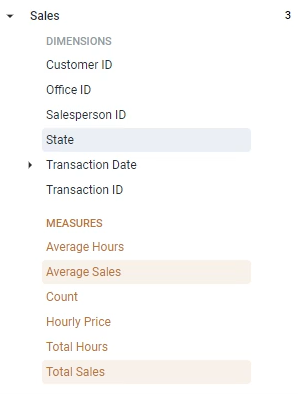

Click `Run` and this tells us for each state, for example, California, we had 4.2 million sales from `California` and each sale you look at each sale, the average sale from California was ninety eight thousand.

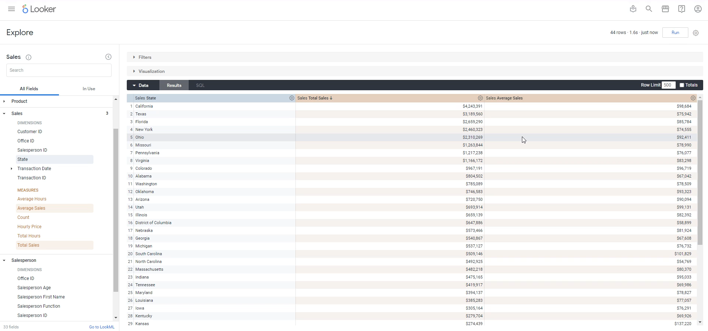

Now, currently, this is not sorted or ordered or anything like that. In order to sort, what we can do is just click the call that we want to sort out.

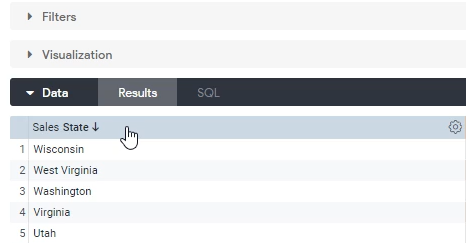

So this sort said that a you can click it again to sort it A to Z.

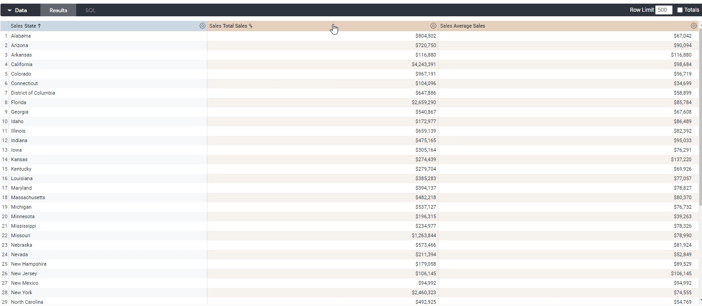

You can also sort the measure columns as well.

So beforehand we saw total sales, so we saw the most amount of sales coming from California and the least amount of sales coming from Oregon.

The average sales of something that you can also do as well.

You can click `average sales`. And now this will sort of buy average sales. So sale tickets in `West Virginia` are much higher.

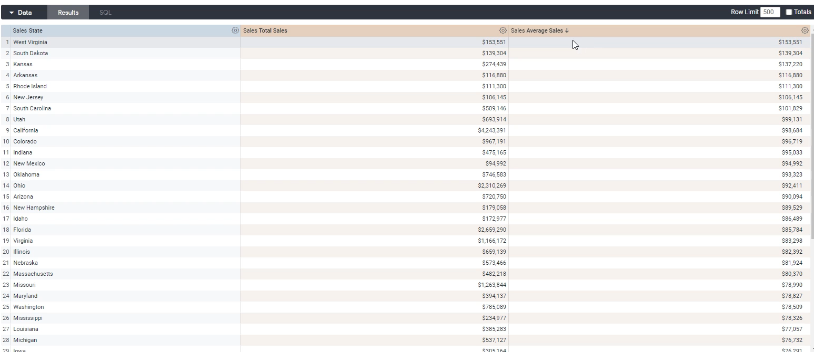

Right, even though it doesn't have lots of sales, it does looks like it, there's only actually one sale from West Virginia, which is the total amount of sales that we see over here.

Something else we can add in here to make our table more visually appealing is we can add **totals**.

If we click this, for example, let's click run over here.

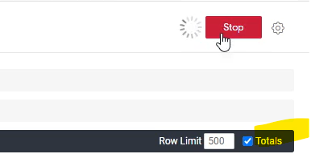

We'll now see totals as well, so we can see our total sales for this time period that we're looking at is thirty two point four million.

And Looker is smart enough to know that this is technically an average, so it doesn't just take the total of an average, which would be wrong.

What it does instead is it takes the average of the entire dataset for sales.

So the average sale across all states or irrespective of any one state is eighty one thousand.

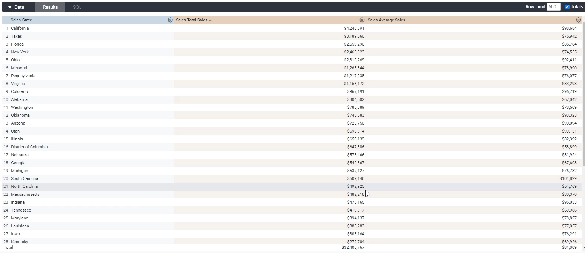

**Row Limit**

By default, your tables will be limited to five rows because what you're doing here again is analysis.

So what you need to do over here is simply change this, to a thousand if you want.

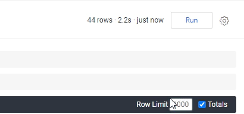

Quick start analysis
--------------------

In this section, we will go through the quick start option for explorers.

Let's go over here and instead now open up the Inventory Explorer, where we have set up the quick start guide.

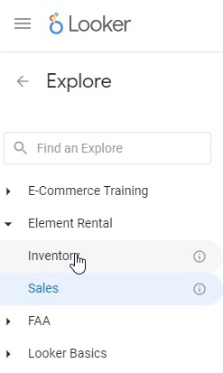

Now again, this is done through the code that we added in lab 1.

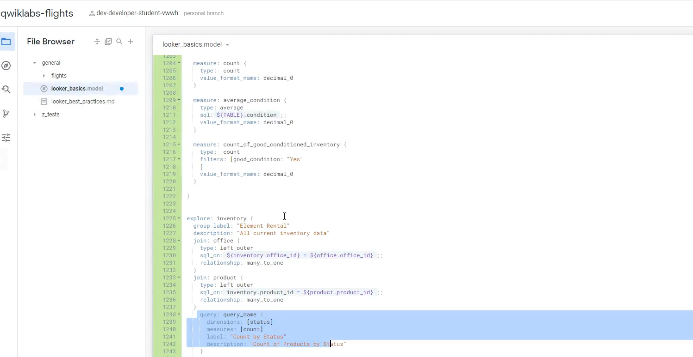

Over here, what this allows you to do is, well, we start from a current analysis that someone has already done.

For example, an inventory, an option that we see over here is the counter by status, which basically gives you the count of products by status.

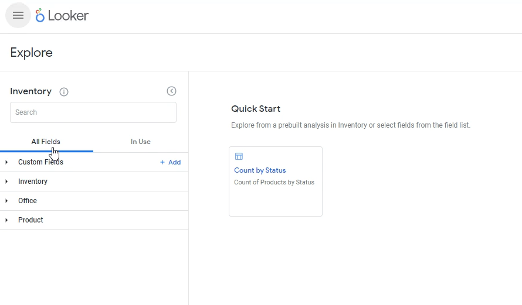

We can `click` it.

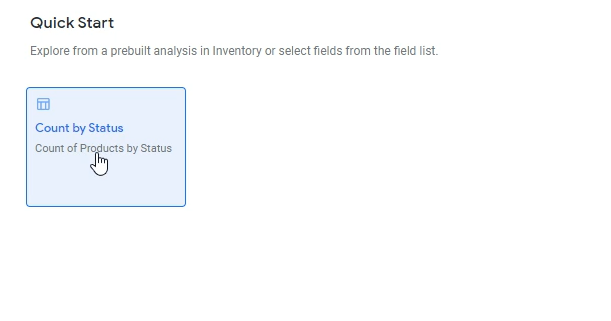

And perfect as clicking, it gives us the information that we would want so we can see over here that in our inventory, we have one hundred and one products that are held and we have 100 products are open.

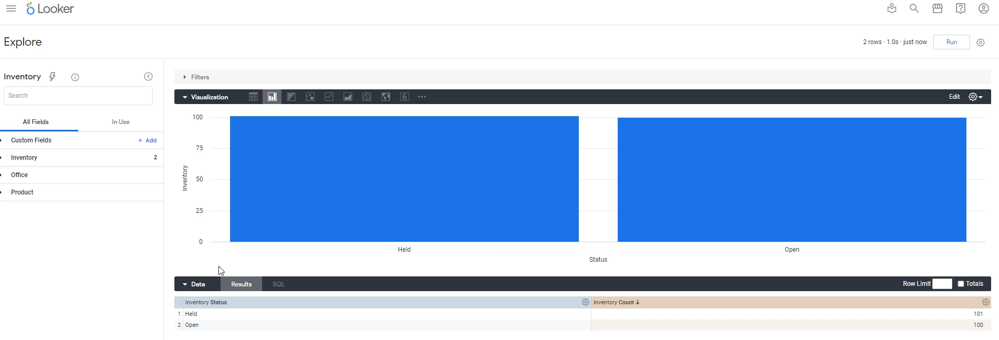

And I know we haven't gone through the visualization as much, but you can see the same thing in the data portion over here.

So a quick start is basically a query that someone has already made for you. You just have to click it and it comes up.

Now an explorer can have more than one. We go back in here, you can have more than one quick start. We only have one over here because that's what I've put in the code. But you can have multiple.

In addition to that, let's say, if I'm an inventory over here and I want to see the count of inventory by office.

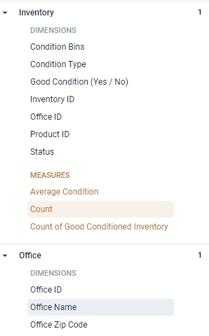

Let's click run.

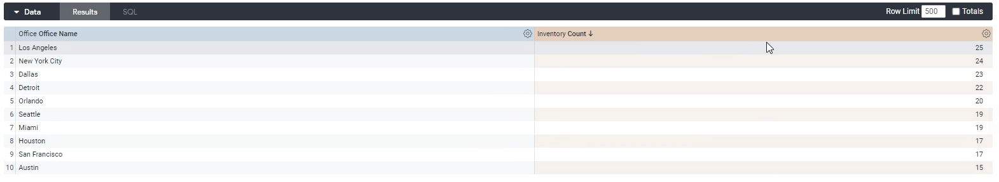

I can see over here that I have 25 products in Los Angeles, 20 for inventory pieces in New York City and so on and so forth.

But if I want to go back, I don't need to refresh the page or anything like that.

I can just click this lightning bolt over here.

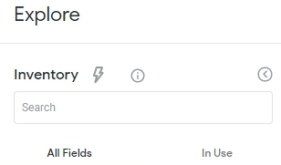

Which pulls up this guy again, and I can just click it, and it populates the correct dimensions and measures for that specific analysis that someone has saved for me.

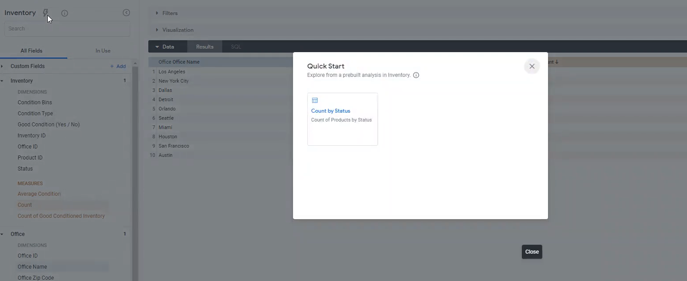

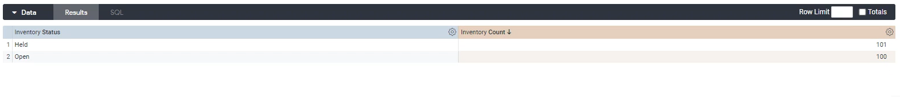

And that's how you use quick start with explorers now, most likely someone has set up Looker for you.

They have set up quick start queries, which are again queries that they've already been set up for you just as a starting point.
