Lab 5: Pivot a Field
---------------------

In this lab, we're going to be learning pivoting a field. It means adding a dimension, but adding it as a column based dimension instead of a robie's dimension.

Let's go through an exercise.

Let's add `product name` and on the right hand side, let's add the `total sales`.

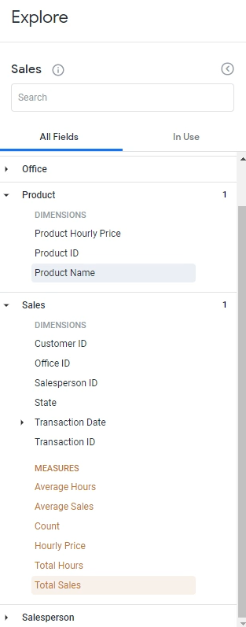

Click `Run` to get the results.

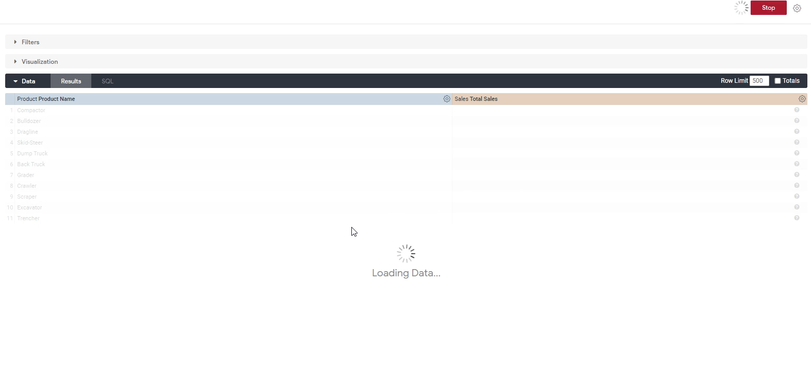

We can see what's the top product sold and the bottom product sold.

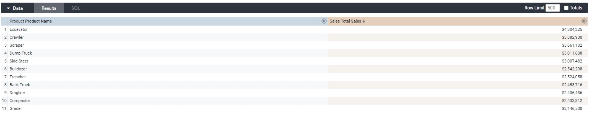

But we also want to look at not only this, but also by the `Salesperson Level` too.

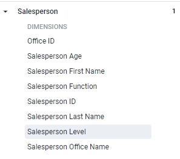

Click `Run` button to get the results. For the juniors, it looks like the `Excavator` is the top product and the seniors looks like the `Compactor` compactors the top product, which is actually very interesting, right?

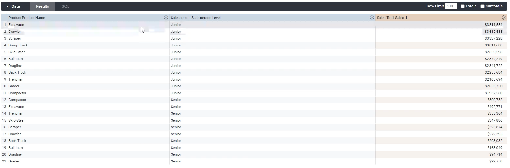

That could be interesting analysis that we have, and we could theoretically add more and more and more dimensions and cut up the data we could example.

Above are row based dimensions. Well, we might want to do, though, is have the `salesperson level` the column based, which means we will get the total sales for each salesperson level.

Well, how we do that is we can click this gear icon over here and click Pivot.

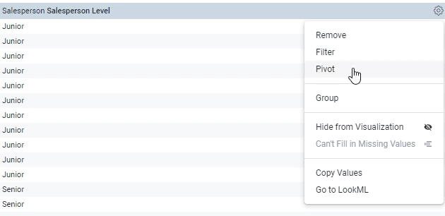

OK, now again, it just shows us the schema, which basically means that over here there'll be multiple columns, so let's click `run` and see what the data looks like now.

So instead of the `salesperson level` being a row wise dimension, now it's a column wise dimension instead.

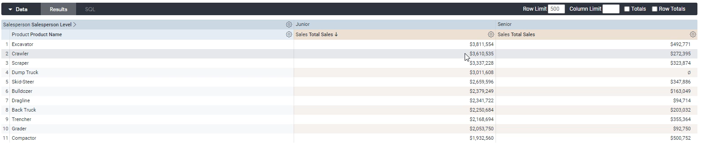

And over here, we quickly see, for example, for the excavator, juniors have sold 3.8 million, whereas seniors have sold 4.9 million.

And we can also add **row totals** and **totals** for good measure as well. We look at the entire view here.

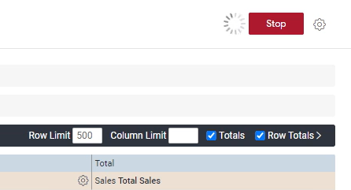

Now, this shows us more information than what we had before it, before we had it at the product sales level.

We still have another product sales level, so if you tell me a product name and a sales of I can tell you what the sales was.

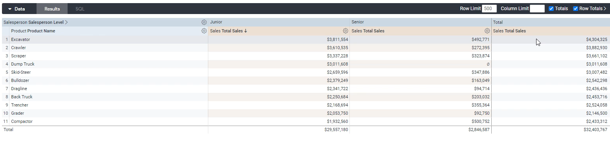

But in addition to that, we now get `totals` where we can see the total excavators $4.3 million or a crawler is $3.8 million and so on.

Sales for junior salespeople comprised $29 million, whereas for seniors, it was $28 million, probably because seniors don't just spend time selling deals to spend time administrating, training and doing other things.

You can also do it pivot directly from left menu, it's showing that `salesperson level` is pivoted right because there's a little little arrow diagonal thing over here.

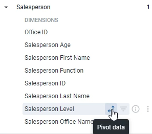

If we in addition to this column, if we want to pivot another column, for example, Let's also pivot `salesperson function`. 
We **don't** actually click the column. Instead, we click this little pivot data instead.

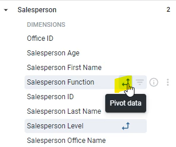

Let's `Run` to see what this looks like.

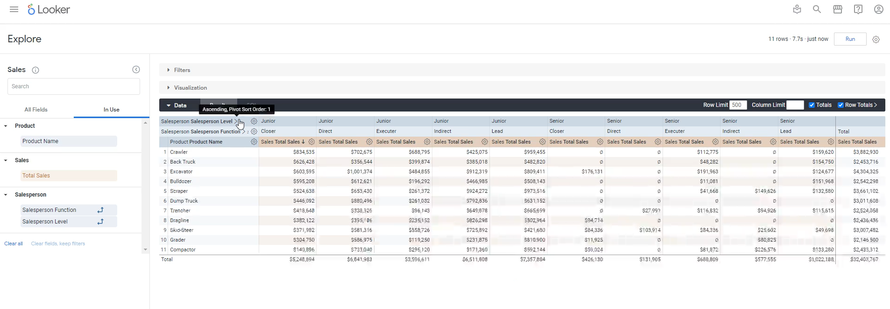

Now we see that sales or the salesperson level and for the actual function as well.

We can see that junior closers pick up `5.2` million, you could also see junior closer by truck, for example, if you want to.

Over here, we can also order this to go, Senior/Junior. We can also make this, for example, Junior/Senior if we want as well.

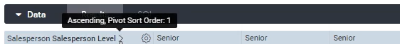

To **unpivot** it, you can just click this guy over here like on Pivot, and that brings it back to the row level.

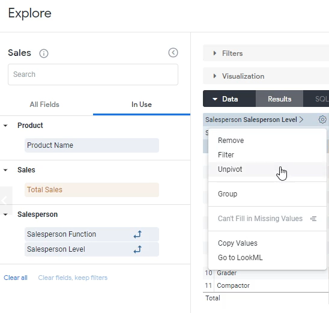

And that's how you pivot a dimension.