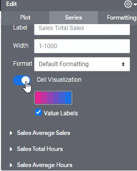

Lab 6: Table Visualization
--------------------------

In this lab, we will start working on visualizations.

Visualizations are simply the graphs, charts, any sort of visuals that basically take the data you have in your data table and visualize it.

Let's go through an exercise.

Let's say we want to look at the count of transactions we're going to do you count of sales by product name.

Let's click `Run` on that.

So we have about, you know, anywhere from 29 to 41 transactions for each product.

Now if we open up visualizations, this will actually visualize the data that we have over here.

And this is primarily used for, you know, things like looks and dashboards being able to visualize the data.

What's nice about this as well is that it's very easy for you to change between different visualizations methods, and we'll go through all of them in more detail.

But in this exercise, what I want to go through is the fact that you open visualizations by clicking the `Visualization` button.

There are multiple things you can choose from. And that each one of these visualizations has a gear icon that you can use to actually edit certain
things, for example, over here.

### Table Visualization

Let's talk about our first visualization, which is the table visualization.

The first thing that we need is an actual what is an actual table to.

To compute what we're going to do over here in our explorer, we're going to look at simply the `office name`.

And we're going to look at the `total sales` and the `average sales`.

OK, let's compute that.

What we're going to do over here is now click `visualization` and then click the `table` icon. So. this is the default table that you should see.

And there's a few things that we can change about it, which makes this more relevant to what we're trying to show.

You know, it's basically a very nice, pretty version of the table that we have here or of the data results that we have here.

But doing it this way, you can actually change certain things about it.

So, what we want to do first is let's go into edit and let's start with the `Plot`.

These are the default ones that are available and looker. So you have the gray theme, the classic theme and transparent.

It looks like Looker prefers the white theme.

You know, it's nice because each row over here is a different color, which makes things nice. But you can use any theme you prefer.

Over here, what we also see is the `Show Row Numbers`, so all tables by default are numbered one through end and they're shown over here, but you can toggle this on and off if you want.

We're going to get rid of it because row numbers for us don't really mean.

OK, we can also show `totals` in this data to if we'd like. So, what we would need to do then is apply `totals` checkbox in Data section.

And now, since this is activated, we can actually see totals over here as well.

Now, we are going to get rid of it, but just note that that option is there.

Transposes also very cool were transposed, does very simply is it basically makes all your role wise dimensions into column wise dimensions and all your column wise dimensions into railways dimensions.

Each row is a dimension. If we if we flip this, we'll see how this changes. We need to get rid of the `totals` icon in Data section.

So what we see over here is what used to be a rows in our columns and what used to be our columns are now our rows.

You can also do this with pivot data as well. So, for example, let's uncheck `Transpose` icon.

Let remove `average sales`. And in addition to office, let also put in `State` and pivot it.

Let's run.

OK, so now this is a very wide table, because our columns are all states now in order to switch these two around.

Well, we can simply just un pivot state and pivot office, or we can just `Transpose` the visualization that we've created, which does that for us.

Well, let's go back to what we had before, so let's get rid of `state`.

And add back in the `average sales`, and I'm also going to add in the `total hours` and the `average hours`.

Let's click `Run`.

You can also `limit displayed rows` if you want.

This feature isn't used that often, but like if you want to, for example, hide the first few
rows or show the first few rows or even hide the loss or show the last rows, you can do that as well.

For example, let's if you have a customer list and you only want to show the top 10 customers.

Well, you can all have all your customers in the underlying data. The visualization only shows your top 10, for example.

Now let's go to `series`. The first thing is you can `Truncate Text`.

Basically what that means and we don't really see an option here.

But if, for example, `Detroit` was very, very long and it spanned more than the column length, then it would truncate if this option is toggled on. If not, then the column would widen to accommodate the actual field.

**Size column to fit** is also very interesting to those columns, to fit  means that the columns will be wide enough, so it fits the entire screen size.

If you untoggle this icon, Looker goes to the actual size of the column name. And if you have lots of columns to see if you have lots of dimensions, for example, this is useful.

Let's untoggle **Size column to fit** icon.

We can also make column wise customizations. So, for example, what we can do over here is these are all the same fonts.

But what if we don't want that to be?

We can, for example, change the font of the office name to something else so we can make it bold.

We can make it a different color if we want. And also justify centre, right and left as well.

We can also make changes to particular columns, too.

So, for example, we can see a `total sales` is using this bar graph type customization, so let me click it.

We can see over here that we have **cell visualization** turned on.

All visualization are only turned on for measures, but we can change the formatting as well.

Right now, it uses the `default formatting` we have over here, which is dollars.

But for example, let's say if this wasn't in dollars and this was in.

You know it because our SQL data it or because our developer didn't set up look tight, this might not be dollars, it might be just numbers instead. Well, you can formatted however you want.

You can add Euros to it. Change to decimals, U.S. dollars with decimals, whatever you need to do.

Again, the cell visualization part is very cool, if you turn this off, it just turns into numbers, but this you can see the graph over here.

You can also change the color palette if you want to.

And again, what your developer might be able to do is create one specific to your company as well.

Right now, these don't have cell visualizations, but you can have many rights you can have, for example, the `total sales` and `total hours`. Both have cell visualizations where we can see.

Now moving on to `formatting` tab, this allows you to format the entire table. So for example, what we can see over here is a `Collection`.

Right now, we're not going to modify it because it's a very particular use case.

What is really interesting, though, is you can change the font size.For example, you can make the Header font size `16`. And the Rows size `14`.

And the reason why this gets more useful and useful is when you show this in a dashboard, for example, you might want this visualization to have a greater font size than a bar graph, for example, because these are actual numbers that you need to look at.

OK, the last thing on this front over here is conditional formatting Well, let's turn it on and show you what we can do with it. It's very similar to Excel, you can conditionally format a cell based on its value, for example.

And one thing to note is that you can't conditionally format a column that has cell visualizations turned on, which means that we won't be able to conditionally format `total sales` and `total hours` since the cell visualization part does that for us.

What we're going to do over here is conditionally format, `average sales`.
Right now, this does it along a scale. but you can conditionally format this based on if the value is greater or is actually less than a certain amount.

If the value, for example, is less than 70000, then that's worrying, because maybe what that would signify is that the sales process isn't efficient enough because each transaction we're only getting $70000.

So if the value is less than $70000, I want the background color actually be red for us to flag that.

We're going to do is add a rule like:

**Apply to**: `Select Fields` > `Sales Average Sales`

**Format**: `If value is less than`

**Value**: 70000

**Background color:** `Red`

Click `Add a rule` button to add new rule.

And there we go. That's a rule that we've created over here. So, now this is not using a scale or a solar visualization instead. We're flagging this based on the average sales of being under a certain amount.

Let's also do the same thing for the hours as well, the average hours depicts for each sale how many hours or is the equipment being rented for.

And let's say if something is, you know, below 50, that's kind of troubling. We're going to add a rule. And we're going to apply this to select fields only to average hours, wait to see if the value is less than 50.

We're going to do is add a rule like:

**Apply to**: `Select Fields` > `Sales Average Hours`

**Format**: `If value is less than`

**Value**: 50

**Background color:** `Red`

We've turned what was a default table into something that's more appropriate to what we want, which is this table over here.

There's a lot more things that we can do over.The first simple one is being able to sort.

Now you can simply click a column to sort by that, think this is currently sorted by `total sales`.

But if we, for example, want to sort by `average hours`, will we just click it and it sorts it for us.

You can also sort of buy a dimension, for example, for if you want to sort of by alphabetical office name.
