Lab 7: Bar and Column Visualization
-----------------------------------

In this lab, we will be going through is the column and bar charts.

These are pretty simple charts to recognize they're used quite often.
And we're going to make a few visualizations of them and see how we can actually edit them.

Let's use `Office Name` as a dimension. And it's already trying to give a visualization of it.

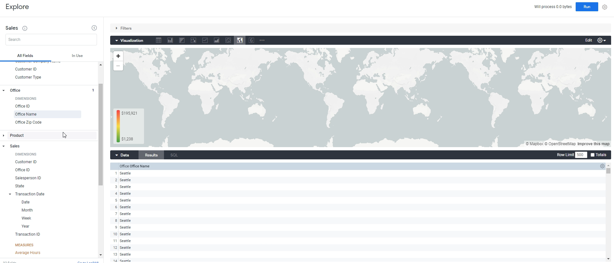

Let's pivot the `salesperson level`. 

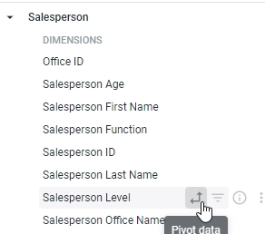

Now, we have office name, salesperson level, and let's get the `total sales`.

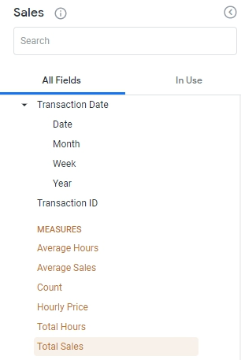

We're just going to call `Run` right now.

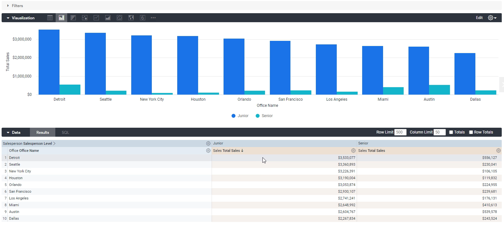

Let's understands how this actually works, we have these total sales divided by office and whether or not it was made by a junior salesperson or a senior salesperson.

In this case, what we get is a grouped column chart. One is junior and other one senior.

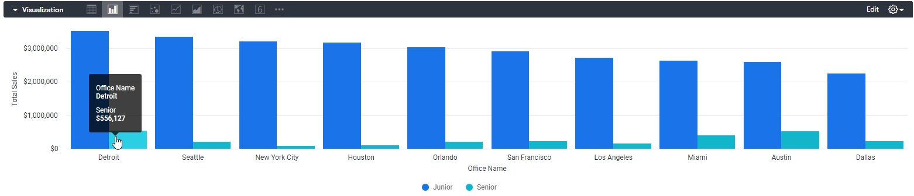

Combined, they make up the total sales for Detroit, so a group doesn't really make sense because these things are naturally just added together, you would add up the sales from your junior and you would out of the sales from your senior to some up to the total sales for Detroit.

Well, that's an option that we can change in the settings, so let's go to Settings and the first thing it asks us is what type of series positioning would you like. `Grouped` is default but  we want **Stacked** instead.

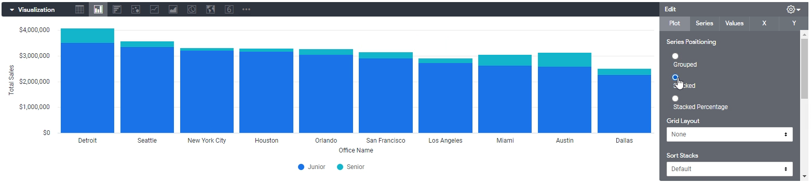

There, this makes a lot more sense. The total bar is the total sales for Detroit, and the individual colors are what sales come from junior salespeople versus what sales come from senior salespeople.

You could also do **Stacked Percentage**, what that means is it'll make each bar the same size.

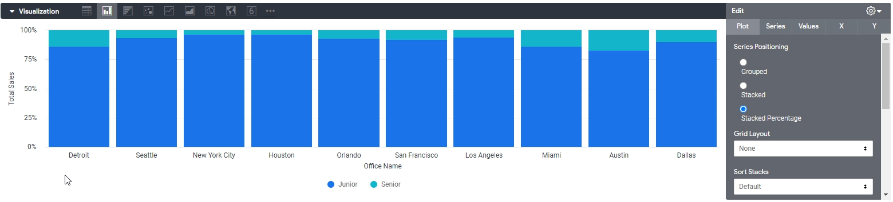

So you can't see, for example, of Detroit has more sales than Houston, but you can see the relative percentages and make up junior versus senior.

So this is if you want to do a percentage of a whole analysis.

Where you were, you don't care about the actual absolute size, but you care about the distribution of the pivot column, and in this case, the pivot column is a salesperson function. This is primarily used again for distribution related reasons.

One cool thing you can do with this, for example, is, well, simply we can remove `salesperson level`. And we could bring in `salesperson function` where there's a lot more values and see how that change.

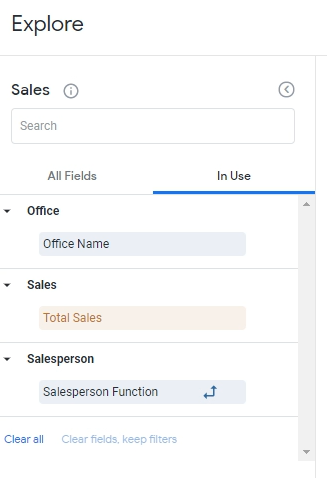

Click `Run`.

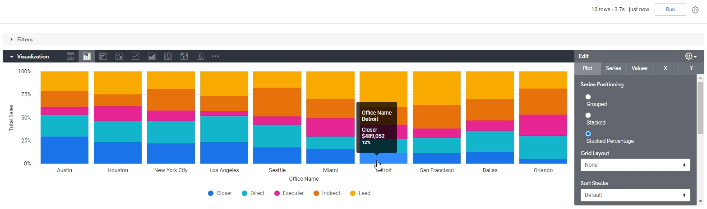

So you can see you don't care what Detroit's `total sales` is, but you can see that Detroit, for example, has a lot more sales from lead salespeople than it does from the rest.

We could see that Los Angeles has a higher percentage of their sales is from direct. And so is Orlando.

If I make this a **Stacked**, you kind of lose that because you don't know if this is actually bigger than this, for example, because or Detroit. Because it might just be bigger because the total size is bigger, not necessarily because the percentage of that is actually bigger.

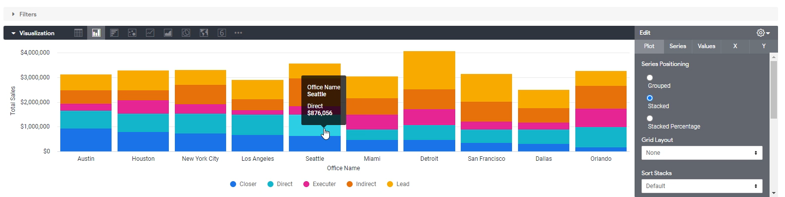

That's the first thing we can change over here. `Grid layout` is also interesting, too. So for example, if you click by Pivot, it basically just lays this out and shows you five different power charts.

Again, not relevant to what we're doing, but if you want a different bar chart for each.

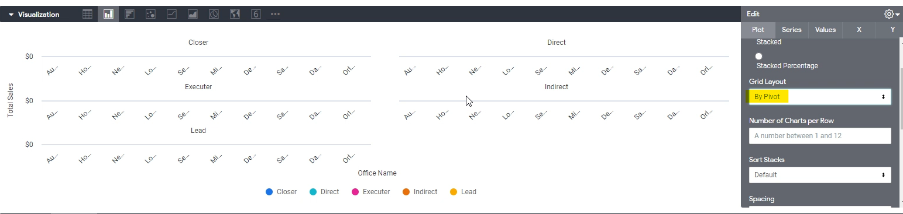

To illustrate this all take out `salesperson function` and put back in what we had before, which was `salesperson level`.

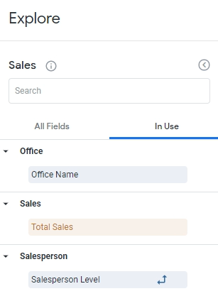

Click `Run`. So, what you see is you see a different bar chart for junior and different one for senior.

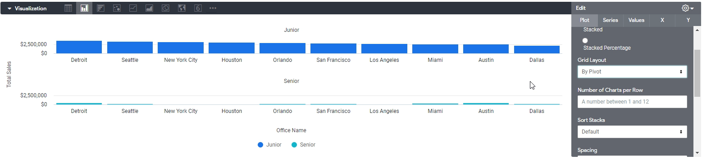

**Note:** Incase there is any glitch, reset `Grid Layout` to original value and change to `By Pivot` again.

We can also sort it if we want as well ascending descending, you can modify spacing as well. But right now it's the default spacing.

But if we change spacing to `0.9`, you can see that there's point nine spacing between each thing.

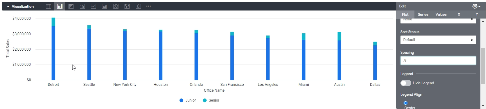

If you do zero, then it'll make it all connected or as closely connected as can get.

Let's move to `Series` tab, this is very similar to the Series four tables. You can modify this, you can, for example, change the palette if we want.

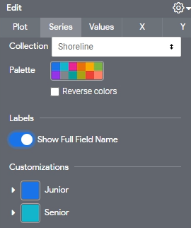

Let's move to `Values` tab. Field `Value Labels` shows us the actual numbers on the chart. You don't have to hover over it.

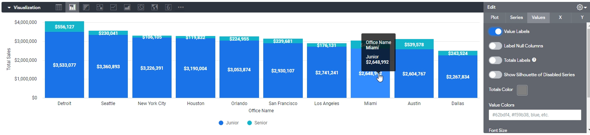

`X` is the horizontal axes over here, so you can make a few changes. We can Determine whether we want to show the axes name or not. We can rotate it as well, which I've not seen used a lot, but you can do that. You can add grid lines to really separate these.

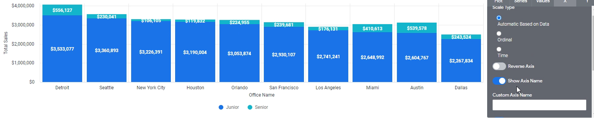

In terms of the `y` axes we can do, we can take out grid lines, add grid lines and we can reverse the axes.
But this is probably the most used thing over here where you can actually determine if you want to use the left axes or the right axes .

Let's get rid of `salesperson level` pivot first. And we not only want to show the `total sales`, but we also want to show the `average sales`.

In this case, it wouldn't make sense to do a stacked or chart because we're mixing in the total sales for Detroit and the average sales per transaction for Detroit.

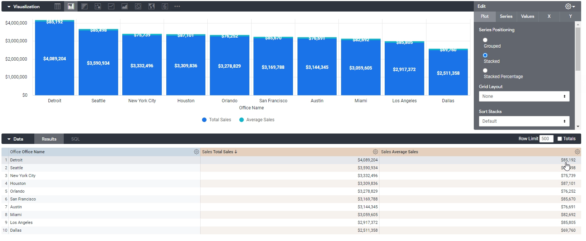

So, we're going to use `Grouped`.

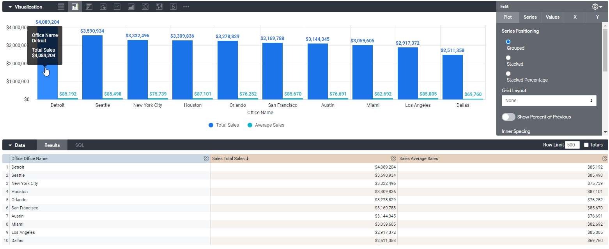

What I want to see very quickly is, Detroit's total sales is four million and each sale they make about 85K.

However, it's really hard to see this 85K and 75K because it's totally encompassed over here.

Well, we want to do is have this series beyond on the left axes and this Series B on the right axes.

OK, what we're going to do is we're going to click Y and you'll see over here we have left axes and right axes.

There's two series under left. There are no series under a right:

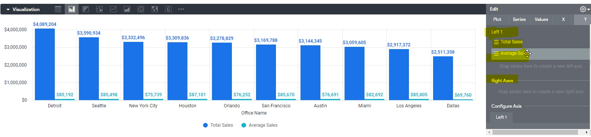

We need to do is move average sales to the right axes and there we go.

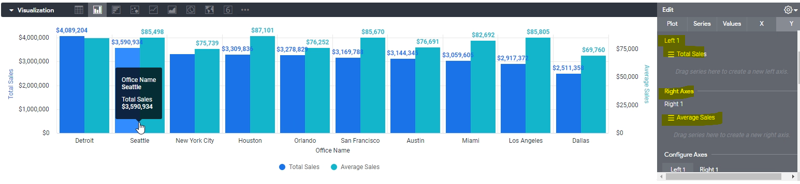

So now this chart clearly shows us now the as we see the assumption here is that blue and green are now on different scales.

Blue is on the left scale, green is on the right scale, so you can't compare blue and green directly anymore. That's not what we want to do anyways. We want to compare the green or the average sales between each city. And Blue, we want to compare it against each city.

This is probably the most used feature I've seen in Column and bar charts being able to shift data this way.

So, that's everything we can do with our charts and column charts.
