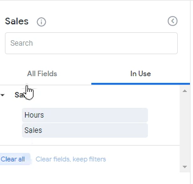

Lab 8: Scatter Visualization
----------------------------

In this lab, we will be going through the scatter plot. A scatterplot is used with two dimensions that are continuous variable.

What that means is there needs to be a dimension, right? The second thing is that the values should be numeric. Better plots only work with numeric or continuous variables.

So, what we're going to do is we are going to graph the relationship here between `sales` as a dimension and `hours` we want to see here is if for a particular transaction, if the number of hours are high, are the sales also high?
If the number of hours are low or the sales also low? That's the point we want to show this in the scatterplot.

Let's click `Run` on sales and hours.

And what we see over here is that each line item here is a transaction ID and on the right hand side we see the `hours`.

So, what we can see over here, for example, is some random transaction ID at sales of $171,424 and that had 88 hours.

Click the `Visualization` option tab and we can see there is a clear relationship between ours and sales.

What's great about scatterplot is you can get a lot of information very quickly.Again, each point here is a particular transaction. So, you can know, for example, that there are transactions where we had 34 hours and fifty one thousand in sales.

Now, let's look at another relationship that might not be this clear, right?

Click `Clear all` to remove all selected options.

Let's instead look at the relationship between `Sales` and `Salesperson Age`.

We'll see if people who have, you know, salespeople who have higher age, who are older have more sales federal or really if their sales amount is higher.

And we can see that there's not really a case over here, and this is why you need to use a continuous variable because age again has finite numbers, right?

There was no twenty point five or twenty one point six or anything like that, but you can see that there's not really a relationship here.

Click `Clear all` to remove all selected options.

**Sizing Dots in Scatter Visualization**

In this exercise, we will learn how to use them with measures and how to modify their dot size based on a measure.

Let's put in `salesperson office name`, and also put in a `Count` as well as the `total sales`.

This tell us not the office that the transaction generated in but instead the office of the salesperson belongs to what's their sales count, how many sales do they do? And what's the total sales?

So again, this is different than just office name, this is the salesperson office thing.

OK, perfect.

Click `Visualization` and it's already done for us.

But if you don't know how to do this, for example, what we see over here is the x axis is salesperson office name. The y axis is actually account of sales.

For example, Austin has 47 transactions. Dallas has 49 transactions.
We're really the office that salespeople from Dallas belong to have 48 transactions.

But the actual size of the dots represent how much total sales is within salespeople that from come from New York City.

So what we can do over here is to activate it, if you start on your end is we can go to `Series`.

And over here, we can see `Size points by field`. You can choose any measure you want. And we're going to say that we want to size the points by `Total Sales`.

Detroit actually has forty one transactions, right? Which is same as Orlando.
But the total sales that come from Detroit is only two point nine million, which is why the circle is alot smaller than Orlando, which is three point seven million.

Those are the types of analysis you can get now where you cannot only see Detroit's relative number of sales, but you could also see the actual the actual total sales as well.
