Lab 9:  Line, Area and Piechart Visualizations
----------------------------------------------

In this lab, we'll go through specifically the line and area charts.
We will be going through all the different edits and changes that we've have done already for previous visualizations. Line and area charts are usually used to show trend over.

In our sales data, we have transaction data split up into date month, week or so, let's select `Month`.

And we're going to run this portal, how many months we have.

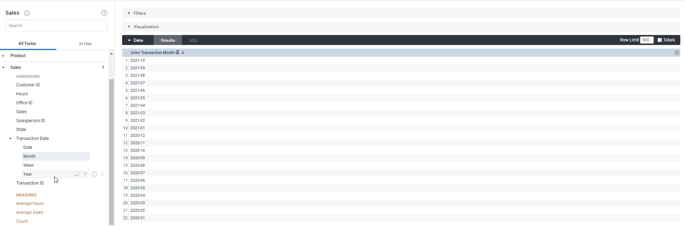

And we're also going to simply put in the `total sales`.

Simple stuff, just the total sales over time, and we'll see if there's any trend there.

Let's select `visualization` and click `line` chart, when we can clearly see that there is a trend of sales over time, you can see the highest month looks like to be September or March.

That's when construction probably starts, which is why our equipment rental company probably has the most amount of sales on that month.

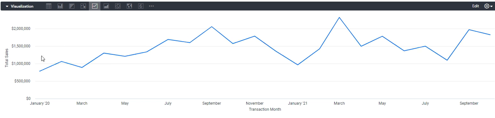

Estimated line charts, as you can add multiple lines to show friends of different things.

So let's only show the total sales, but also the `total hours` that we've spent renting things.

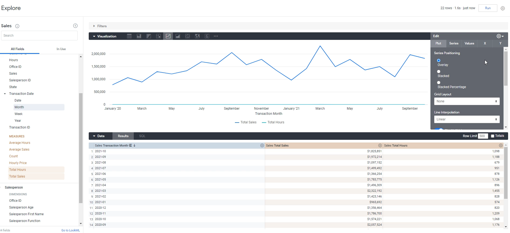

Now these two things should be very, very similar.

We need to do the same thing we did before i-e: set them on different scales.
We need to go to `Y` and move `total hours` to the right axes. As you can see, it's it's almost the same.

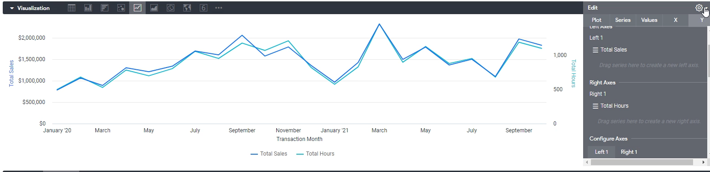

**Area Charts**

Let's go on to area. Now, area simply just fills in what's underneath line.
What's nice about area charts is you can see not only the trend, but the distribution as well.

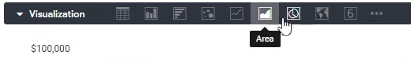

Let's remove `total hours` first. And now we're going to add a pivot.

Let's just run this for now, and we'll see how it differs.

So. this is just total sales. Same as a line chart what we had before.

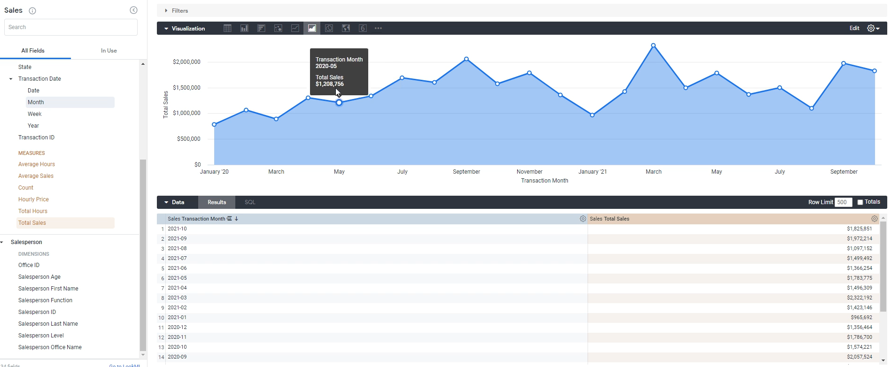

But what's nice about this is we can actually distribute it.
Let's distributed by `Salesperson Function`. Click `pivot` and then click run.

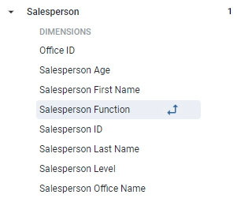

The run and we'll see the area will be split up into different colors.

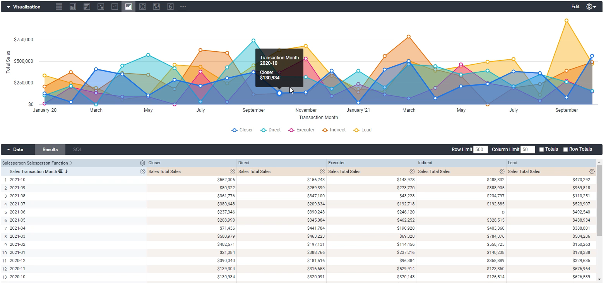

OK, now we can see what comes from closer's versus direct versus.

We lost the original trend, we don't know what month was the highest overall because they're all, you know, they're all on top of each other.
Instead, what we want to do is we want them to be stacked.

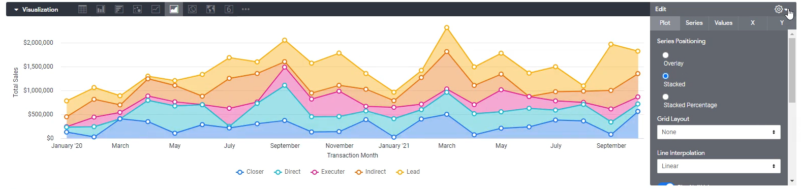

If we click **Stacked** and we get back to the original trend. We can actually see the distribution now. This is used a lot in sales settings where you want to show the distribution of sales by different products for.

**Piechart Visualizations**

In this exercise, we'll go through Piechart. Let's say if we want to look at the distribution of sales.

**Note:** Remove all selected fields from previous exercise before adding below fieldsfirst.

Let's select `Total Sales` and `Product Name`.

Let's click, run and see what it looks like. So we'll just click the piechart button and there we go.

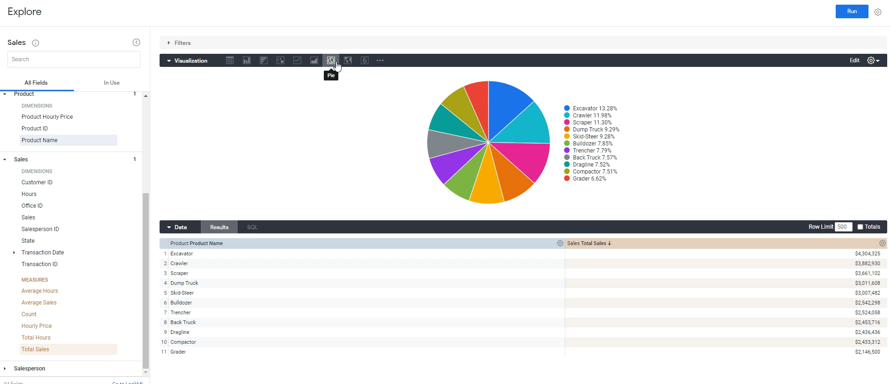

We have a simple looking pie chart that we can edit now. Some key things that you can edit about pie charts.

You can edit the start angle and the end angle.
So what you can do over here is you can limit the pie chart to, for example, half of it, if you. And now this only shows us the data that we have in half a circle.

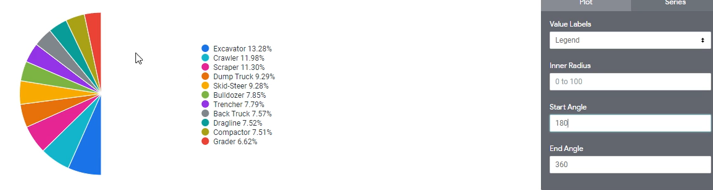

You can also do a quarter, for example, by just doing 270 to 360.

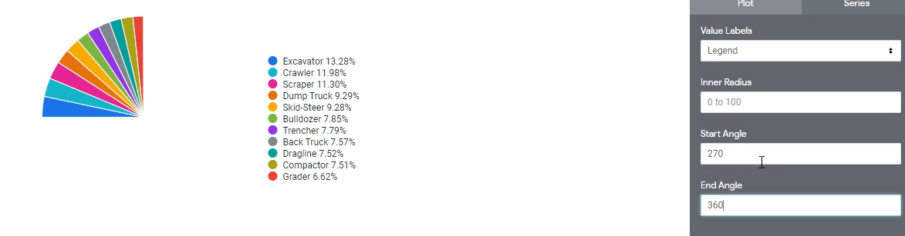

If we go to `series`, you can change the color of specific things if you like.

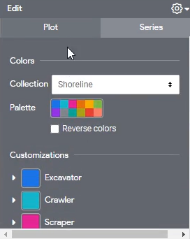

You can change, for example, this to a different color if that matches whatever you're doing more and you can change the label here as well.

